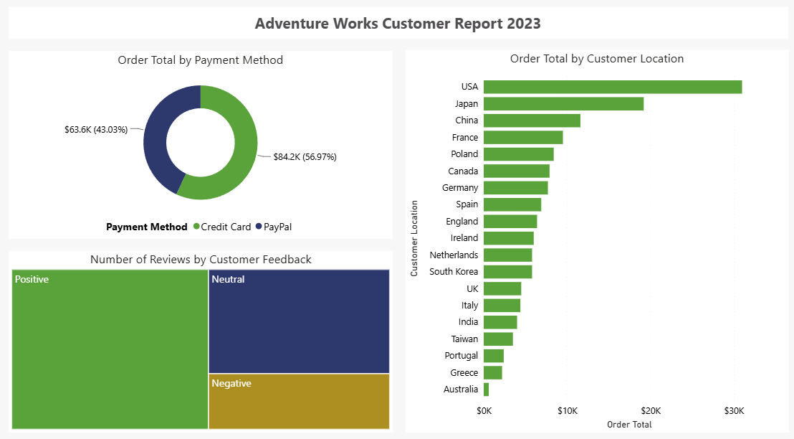
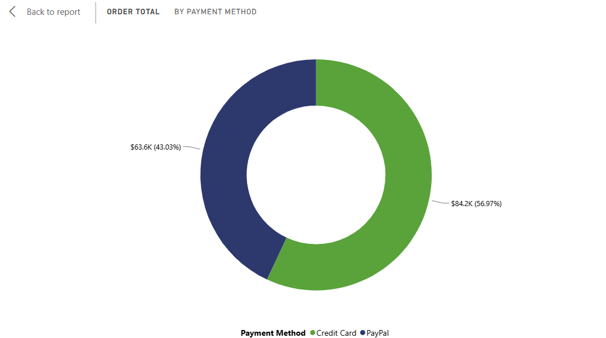
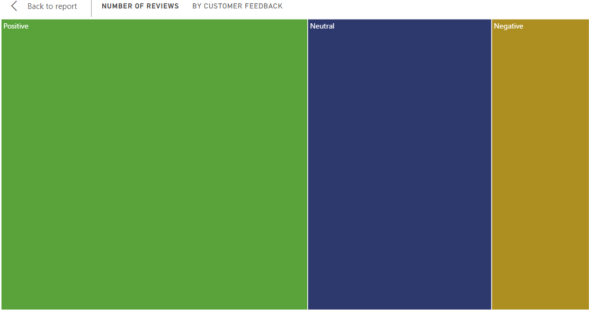

Proyek *Data Visualization* yang dikerjakan sebagai latihan praktik (*hands-on lab*) dari course **Microsoft Data Analysis and Visualization with Power BI (Coursera)**. Laporan "Adventure Works Customer Report 2023" ini melengkapi rangkaian project sebelumnya (laporan pesanan dan laporan produk) dengan berfokus pada sisi pelanggan itu sendiri, mencakup preferensi pembayaran, sentimen feedback, dan sebaran lokasi.

## Overview (Gambaran Umum)

Laporan ini dibangun di atas dataset **Adventure Works Sales**, dengan fokus pada perilaku dan karakteristik pelanggan seperti *Payment Method, Customer Feedback*, dan *Customer Location*, dipasangkan dengan metrik `Order Total` dan `Customer ID`. Tujuannya adalah memahami bagaimana pelanggan bertransaksi, bagaimana persepsi mereka terhadap layanan, dan dari mana asal mereka.

## Latar Belakang & Tujuan

**Latar Belakang:**
Data penjualan saja tidak cukup untuk memahami bisnis secara utuh. Memahami siapa pelanggan, bagaimana mereka membayar, dan apa yang mereka rasakan terhadap layanan sama pentingnya dengan angka penjualan itu sendiri, karena berkaitan langsung dengan retensi dan kepuasan pelanggan.

**Tujuan Project:**
- Membangun laporan overview pelanggan yang merangkum tiga dimensi berbeda dalam satu halaman.
- Melatih pemilihan jenis visual Power BI yang tepat untuk data kategorikal dan proporsional, termasuk penggunaan Treemap untuk data kualitatif seperti feedback pelanggan.
- Menjaga konsistensi desain visual dengan tema **Accessible City Park** yang sama seperti project-project sebelumnya dalam rangkaian ini.

## Implementasi

- **Donut Chart:** Menampilkan `Sum(Order Total)` berdasarkan `Payment Method`, menunjukkan kontribusi tiap metode pembayaran terhadap total nilai transaksi.
- **Treemap:** Menampilkan `Count(Customer ID)` berdasarkan `Customer Feedback`, dipilih karena Treemap cocok untuk membandingkan proporsi kategori kualitatif (seperti komentar/rating feedback) secara sekilas melalui ukuran blok.
- **Clustered Bar Chart:** Menampilkan `Sum(Order Total)` berdasarkan `Customer Location`, ditempatkan memanjang penuh di sisi kanan halaman agar seluruh lokasi pelanggan dapat dibandingkan tanpa terpotong.
- **Header Judul:** Textbox judul "Adventure Works Customer Report 2023" ditempatkan rata tengah di bagian atas halaman.
- **Konsistensi Tema:** Menggunakan palet warna kustom **Accessible City Park** yang sama dengan project-project sebelumnya dalam rangkaian laporan Adventure Works ini.

## Insight Data

- **Donut Chart** menjawab pertanyaan: metode pembayaran apa yang paling banyak dipakai pelanggan dalam bertransaksi.
- **Treemap** menjawab pertanyaan: bagaimana sebaran sentimen/isi feedback yang paling sering diberikan pelanggan.
- **Clustered Bar Chart** menjawab pertanyaan: dari lokasi mana kontribusi nilai penjualan pelanggan terbesar berasal.

Nilai agregat aktual pada tiap chart tersimpan di dalam *data model* terkompresi milik Power BI, sehingga tidak dapat dibaca langsung dari struktur file. Nilai dan tren spesifik dapat dilihat langsung ketika laporan dibuka di Power BI Desktop atau Power BI Service.

## Relevansi Dunia Kerja

Ketiga sudut pandang pada laporan ini merupakan kebutuhan analitis umum di tim customer experience dan finance: breakdown metode pembayaran membantu tim finance mengevaluasi biaya transaksi tiap kanal pembayaran, ringkasan feedback membantu tim customer service memprioritaskan area perbaikan layanan, dan sebaran lokasi pelanggan membantu tim sales/marketing menentukan target retensi maupun ekspansi pasar.

## Visualisasi Utama

*Gambar 1: Tampilan penuh laporan "Adventure Works Customer Report 2023".*

*Gambar 2: Donut Chart total nilai transaksi berdasarkan metode pembayaran.*

*Gambar 3: Treemap sebaran jumlah pelanggan berdasarkan feedback yang diberikan.*

## Pengembangan Selanjutnya

- Menerapkan fitur aksesibilitas (Alt Text dan Tab Order) yang sudah dipraktikkan pada project laporan aksesibilitas ke laporan ini.
- Menambahkan analisis sentimen sederhana pada kolom Customer Feedback untuk mengelompokkan feedback positif dan negatif secara lebih terstruktur.
- Menggabungkan keempat laporan Adventure Works (order, product sales, customer, dan accessible report) menjadi satu laporan multi-halaman yang saling terhubung lewat drill-through.

**Project Status**: Completed
**GitHub**: [Lihat File Power BI (.pbix)](https://github.com/DanuSetiawan05/Adventure-Works-Customer-Report-PowerBI)
