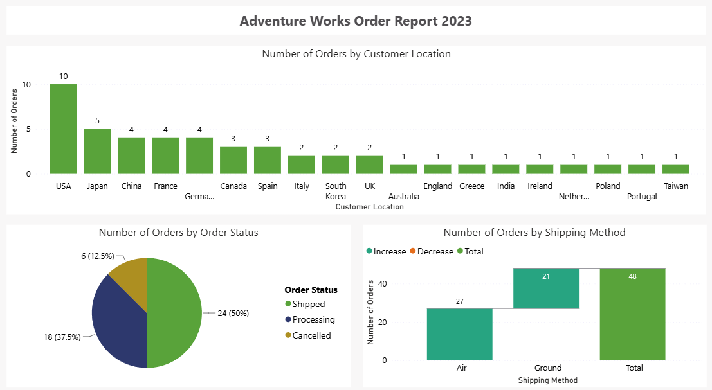
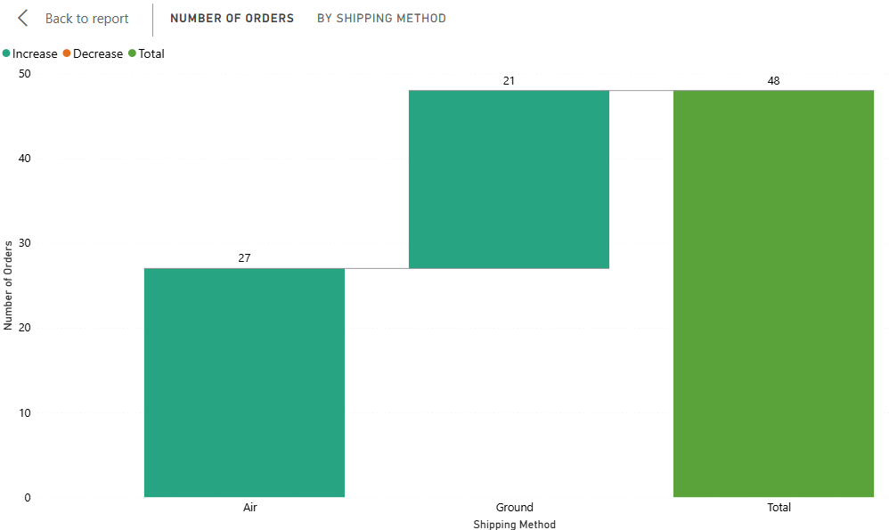
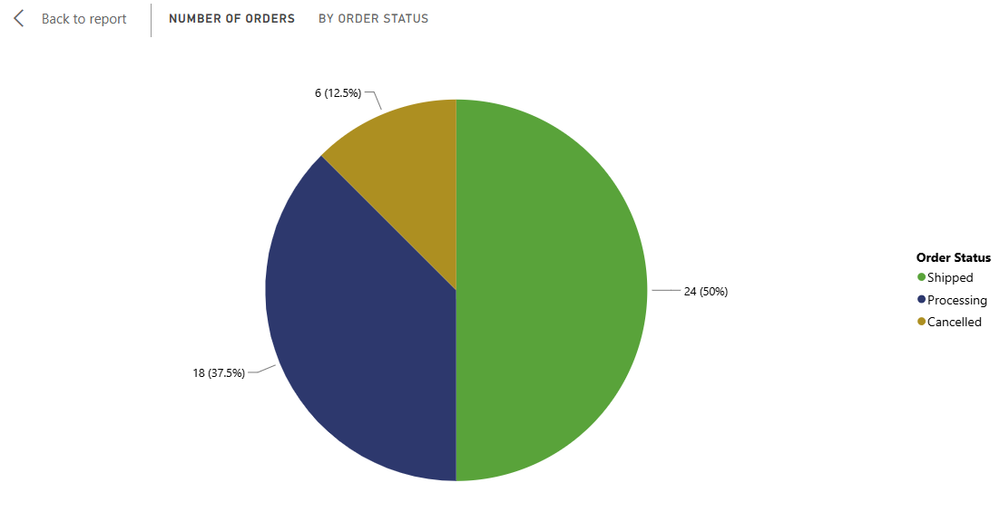

Proyek *Data Visualization* yang dikerjakan sebagai latihan praktik (*hands-on lab*) dari course **Microsoft Data Analysis and Visualization with Power BI (Coursera)**. Berbeda dari project sebelumnya yang berfokus pada prinsip aksesibilitas, laporan "Adventure Works Order Report 2023" ini berfokus pada eksplorasi data pesanan menggunakan variasi jenis visual Power BI yang lebih luas, untuk memahami pola pesanan dari beberapa dimensi operasional sekaligus.

## Overview (Gambaran Umum)

Laporan ini dibangun di atas dataset **Adventure Works Sales**, dengan fokus pada entitas pesanan (*Order*) yang mencakup field *Order ID, Shipping Method, Customer Location*, dan *Order Status*. Tujuannya adalah membangun satu halaman laporan yang dapat menjawab tiga pertanyaan analitis berbeda sekaligus: bagaimana distribusi metode pengiriman yang digunakan, bagaimana sebaran lokasi pelanggan yang memesan, dan bagaimana proporsi status penyelesaian pesanan.

## Latar Belakang & Tujuan

**Latar Belakang:**
Data pesanan mentah biasanya sulit dibaca langsung dalam bentuk tabel. Memilih jenis visual yang tepat untuk tiap dimensi data (bukan sekadar bar chart untuk semuanya) adalah keterampilan penting dalam *data visualization*, karena setiap jenis chart punya kekuatan berbeda dalam menyampaikan pola tertentu.

**Tujuan Project:**
- Membangun laporan overview pesanan yang merangkum tiga dimensi berbeda dalam satu halaman.
- Melatih pemilihan jenis visual Power BI (Waterfall Chart, Clustered Column Chart, Pie Chart) sesuai karakteristik pertanyaan yang ingin dijawab.
- Menjaga konsistensi desain visual dengan menerapkan tema **Accessible City Park** yang sama seperti project laporan sebelumnya.

## Implementasi

- **Waterfall Chart:** Menampilkan `Count of Order ID` berdasarkan `Shipping Method`, cocok untuk melihat kontribusi tiap metode pengiriman terhadap total pesanan secara bertahap.
- **Clustered Column Chart:** Menampilkan `Count of Order ID` berdasarkan `Customer Location`, diposisikan lebar penuh (*full width*) agar perbandingan antar lokasi mudah dibaca.
- **Pie Chart:** Menampilkan `Count of Order ID` berdasarkan `Order Status`, dipilih karena tujuannya adalah menunjukkan proporsi, bukan perbandingan nilai absolut.
- **Header Judul:** Textbox judul "Adventure Works Order Report 2023" ditempatkan rata tengah di bagian atas halaman sebagai identitas laporan.
- **Konsistensi Tema:** Menggunakan palet warna kustom **Accessible City Park** yang sama dengan project sebelumnya, menjaga identitas visual tetap konsisten antar laporan.

## Insight Data

- **Waterfall Chart** menjawab pertanyaan: metode pengiriman apa yang paling banyak dan paling sedikit digunakan pelanggan.
- **Clustered Column Chart** menjawab pertanyaan: dari lokasi mana volume pesanan terbanyak berasal.
- **Pie Chart** menjawab pertanyaan: seberapa besar proporsi pesanan yang selesai, masih diproses, atau dibatalkan.

## Relevansi Dunia Kerja

Ketiga sudut pandang yang dibangun pada laporan ini merupakan kebutuhan analitis yang umum di lingkungan bisnis: tim logistik/operasional dapat memakai breakdown metode pengiriman untuk evaluasi biaya dan performa kurir, tim sales/marketing dapat memakai sebaran lokasi pelanggan untuk menentukan target ekspansi pasar, dan tim manajemen dapat memantau kesehatan proses pemenuhan pesanan lewat proporsi status pesanan.

## Visualisasi Utama

*Gambar 1: Tampilan penuh laporan "Adventure Works Order Report 2023".*

*Gambar 2: Waterfall Chart jumlah pesanan berdasarkan metode pengiriman.*

*Gambar 3: Pie Chart proporsi status pesanan (selesai, diproses, dibatalkan).*

## Pengembangan Selanjutnya

- Menerapkan fitur aksesibilitas (Alt Text dan Tab Order) yang sudah dipraktikkan pada project sebelumnya ke laporan ini.
- Menambahkan slicer tanggal agar pengguna dapat memfilter laporan berdasarkan periode tertentu.
- Menggabungkan laporan ini dengan laporan penjualan regional sebelumnya menjadi satu laporan multi-halaman yang saling terhubung lewat drill-through.

**Project Status**: ✅ Completed  
**GitHub**: [Lihat File Power BI (.pbix)](https://github.com/DanuSetiawan05/Adventure-Works-Order-Report-PowerBI)
