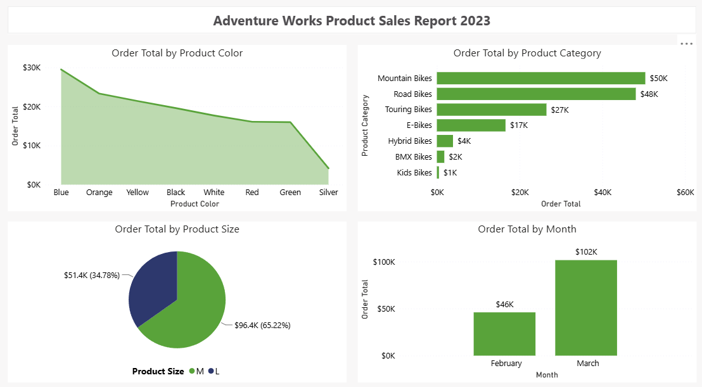
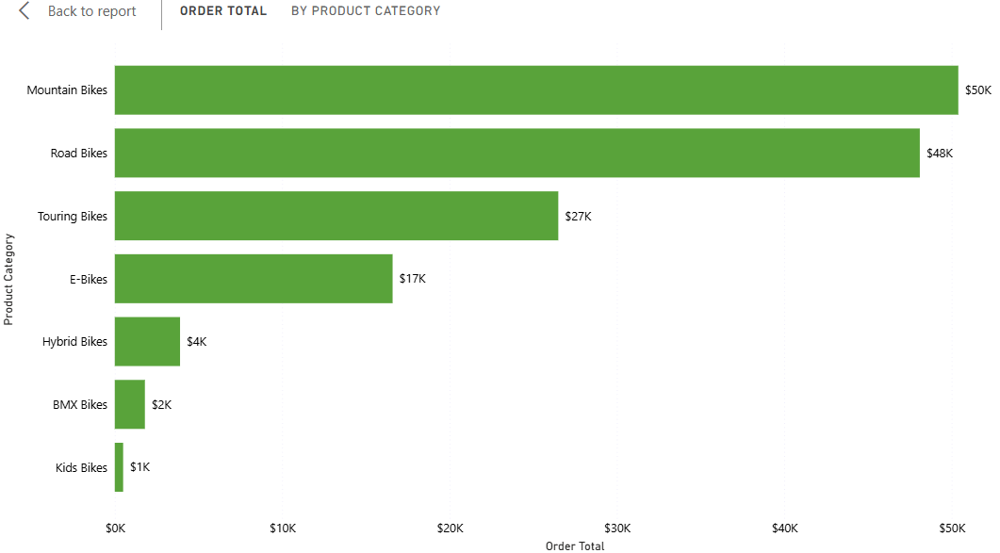
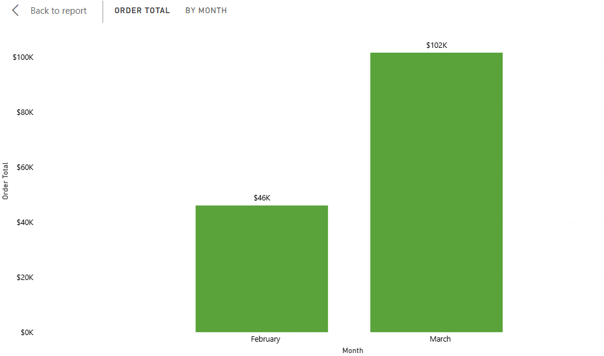

Proyek *Data Visualization* yang dikerjakan sebagai latihan praktik (*hands-on lab*) dari course **Microsoft Data Analysis and Visualization with Power BI (Coursera)**. Laporan "Adventure Works Product Sales Report 2023" ini melengkapi rangkaian project sebelumnya (laporan pesanan) dengan berfokus pada performa penjualan dari sisi produk itu sendiri, seperti warna, kategori, ukuran, dan tren waktu.

## Overview (Gambaran Umum)

Laporan ini dibangun di atas dataset **Adventure Works Sales**, dengan fokus pada nilai transaksi (`Sum of Order Total`) yang dipecah berdasarkan atribut produk seperti *Product Color, Product Category, Product Subcategory, Product Size*, serta dimensi waktu dari *Order Date*. Tujuannya adalah memahami produk atau atribut produk mana yang paling berkontribusi terhadap total penjualan, dan bagaimana pola penjualan tersebut bergerak sepanjang waktu.

## Latar Belakang & Tujuan

**Latar Belakang:**
Bagi tim produk maupun sales, memahami kontribusi penjualan bukan hanya dari sisi "berapa banyak transaksi", melainkan dari sisi "produk seperti apa yang terjual" (warna, kategori, ukuran) jauh lebih berguna untuk perencanaan stok dan strategi pemasaran ke depan.

**Tujuan Project:**
- Membangun laporan performa penjualan produk yang merangkum empat dimensi analisis berbeda dalam satu halaman.
- Melatih pemilihan jenis visual Power BI yang sesuai karakteristik data: proporsi (Pie Chart), perbandingan kategori berjenjang (Clustered Bar Chart dengan hierarki), komposisi terhadap waktu (Stacked Area Chart), dan tren waktu (Clustered Column Chart dengan Date Hierarchy).
- Menjaga konsistensi desain visual dengan tema **Accessible City Park** yang sama seperti project-project sebelumnya dalam rangkaian ini.

## Implementasi

- **Stacked Area Chart:** Menampilkan `Sum(Order Total)` berdasarkan `Product Color`, memperlihatkan kontribusi tiap warna produk terhadap total penjualan.
- **Clustered Bar Chart:** Menampilkan `Sum(Order Total)` berdasarkan hierarki `Product Category` dan `Product Subcategory`, memungkinkan perbandingan penjualan antar kategori sekaligus drill-down ke level subkategori.
- **Pie Chart:** Menampilkan `Sum(Order Total)` berdasarkan `Product Size`, dipilih karena tujuannya menunjukkan proporsi ukuran produk yang paling laku terhadap keseluruhan penjualan.
- **Clustered Column Chart:** Menampilkan `Sum(Order Total)` berdasarkan `Order Date` (Date Hierarchy level Month), untuk melihat tren penjualan bulanan dan berpotensi di-drill-down ke level lebih detail.
- **Header Judul:** Textbox judul "Adventure Works Product Sales Report 2023" ditempatkan rata tengah di bagian atas halaman.
- **Konsistensi Tema:** Menggunakan palet warna kustom **Accessible City Park** yang sama dengan project-project sebelumnya dalam rangkaian laporan Adventure Works ini.

## Insight Data

- **Stacked Area Chart** menjawab pertanyaan: warna produk apa yang paling banyak menyumbang total penjualan.
- **Clustered Bar Chart** menjawab pertanyaan: kategori dan subkategori produk mana yang menghasilkan penjualan tertinggi.
- **Pie Chart** menjawab pertanyaan: ukuran produk apa yang mendominasi total nilai penjualan.
- **Clustered Column Chart** menjawab pertanyaan: bagaimana pergerakan total penjualan dari bulan ke bulan.

## Relevansi Dunia Kerja

Keempat sudut pandang pada laporan ini merupakan kebutuhan analitis umum di tim produk dan sales: memahami preferensi warna dan ukuran produk membantu perencanaan stok dan pembelian, breakdown kategori/subkategori membantu evaluasi lini produk mana yang perlu didorong lebih jauh, dan tren bulanan membantu tim manajemen memantau musiman (*seasonality*) penjualan untuk perencanaan target berikutnya.

## Visualisasi Utama

*Gambar 1: Tampilan penuh laporan "Adventure Works Product Sales Report 2023".*

*Gambar 2: Clustered Bar Chart total penjualan berdasarkan kategori dan subkategori produk.*

*Gambar 3: Clustered Column Chart tren total penjualan bulanan.*

## Pengembangan Selanjutnya

- Menerapkan fitur aksesibilitas (Alt Text dan Tab Order) yang sudah dipraktikkan pada project laporan sebelumnya ke laporan ini.
- Menambahkan slicer kategori produk dan rentang tanggal agar laporan dapat difilter sesuai kebutuhan eksplorasi.
- Menggabungkan ketiga laporan Adventure Works (order report, product sales report, dan accessible report) menjadi satu laporan multi-halaman yang saling terhubung lewat drill-through.

**Project Status**: Completed
**GitHub**: [Lihat File Power BI (.pbix)](https://github.com/DanuSetiawan05/Adventure-Works-Product-Sales-Report-PowerBI)
