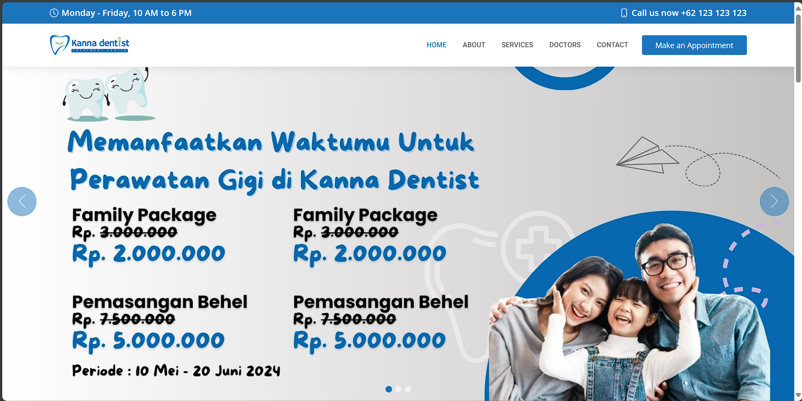
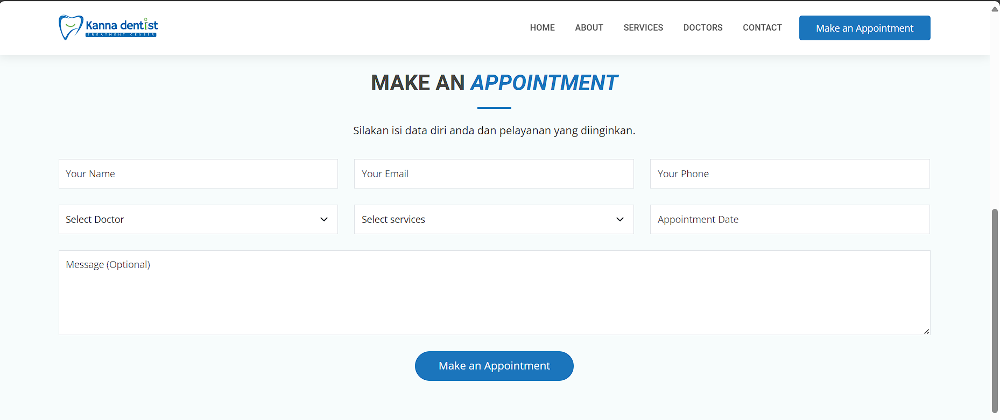
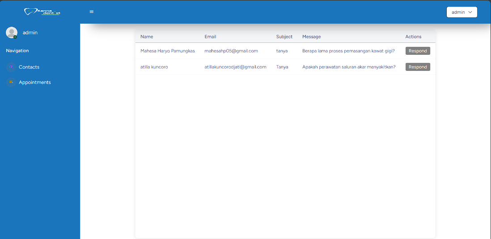
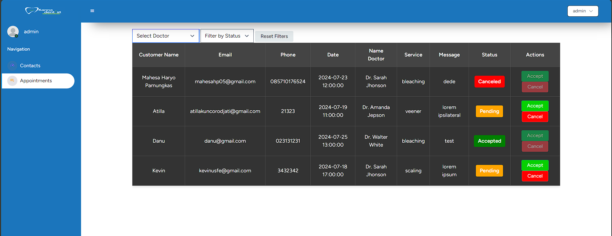
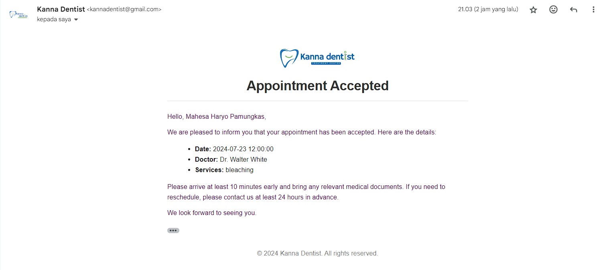

Proyek *Web Development Full-Stack* untuk membangun sistem informasi klinik gigi komprehensif, "Kanna Dentist". Proyek ini berfokus pada digitalisasi proses pendaftaran pasien dan manajemen klinik yang sebelumnya manual, dengan mengutamakan pengalaman pengguna (UX) yang responsif dan sistem manajemen basis data (*database management*) yang efisien di sisi *backend*.

## Overview (Gambaran Umum)

Kanna Dentist dirancang sebagai solusi *end-to-end* bagi klinik gigi. Sistem ini memungkinkan pasien untuk melihat profil klinik, layanan yang tersedia, jadwal dokter, serta melakukan *booking* (janji temu) secara online. Di sisi lain, aplikasi ini menyediakan *Dashboard Admin* yang aman bagi staf klinik untuk mengelola data kontak masuk dan mengonfirmasi atau menolak permohonan janji temu pasien secara *real-time*.

## Fitur Utama (Key Features)

### Untuk Pasien (Frontend)
- **Katalog Layanan & Dokter:** Pasien dapat menjelajahi informasi klinik, detail layanan, dan profil dokter (lengkap dengan tautan media sosial).
- **Online Booking System:** Formulir interaktif untuk memesan jadwal (*appointment*) berdasarkan ketersediaan waktu dan layanan.
- **Lokasi & Kontak:** Integrasi Google Maps yang di-embed langsung ke dalam halaman kontak.
- **Notifikasi Cerdas:** Pasien menerima pemberitahuan via email secara otomatis ketika status *appointment* mereka diterima (*Accepted*) atau dibatalkan (*Canceled*).

### Untuk Staf Klinik (Admin Dashboard)
- **Secure Authentication:** Sistem login yang aman khusus untuk administrator klinik.
- **Manajemen Operasional:** *Dashboard* sentralisasi untuk mengelola dua entitas data utama: pesan dari pasien (*Contacts*) dan daftar janji temu (*Appointments*).
- **Filter & Aksi Cepat:** Admin dapat menyaring *appointment* berdasarkan nama dokter atau status (Pending, Accepted, Canceled) dan meresponsnya dengan satu klik.
- **Auto-Reply Engine:** Integrasi pengiriman email respons langsung dari dalam *dashboard* kepada pasien.

## Arsitektur Teknis (Tech Stack)

Aplikasi ini dibangun menggunakan tumpukan teknologi ( *tech stack* ) yang tangguh dan terukur:
*   **Backend:** PHP 8+ dengan framework **Laravel**, mengimplementasikan pola desain MVC (*Model-View-Controller*) untuk kode yang rapi dan *maintainable*.
*   **Frontend:** Blade Templating Engine (bawaan Laravel), dikombinasikan dengan HTML5, CSS3, dan *Vanilla JavaScript* untuk interaktivitas komponen.
*   **Database:** **MySQL** untuk manajemen relasi data yang kompleks (seperti relasi antara pasien, dokter, dan jadwal).
*   **Integrasi Pihak Ketiga:** Menggunakan modul **Laravel Mail** (SMTP) untuk *handling* antrean dan pengiriman email notifikasi.

## Visualisasi Utama

*Gambar 1: Tampilan Landing Page Kanna Dentist yang responsif untuk kemudahan pasien mencari informasi.*

*Gambar 2: Formulir pemesanan jadwal online interaktif (Make Appointment) di mana pasien dapat memilih layanan, dokter, serta waktu kunjungan dengan antarmuka yang user-friendly.*

*Gambar 3: Antarmuka Dashboard Admin untuk memantau metrik operasional dan mengelola status janji temu pasien.*

*Gambar 4: Modul manajemen Appointment (CRUD) dengan fitur filter dan aksi perubahan status.*

*Gambar 5: Tampilan auto-generated email notification yang dikirim oleh sistem Laravel Mail kepada pasien untuk memberikan update otomatis setiap kali status janji temu mereka diperbarui oleh admin.*

---

**Project Status**: ✅ Completed  
**GitHub**: [Lihat Source Code (Laravel)](https://github.com/DanuSetiawan05/Appointment-Dentist)