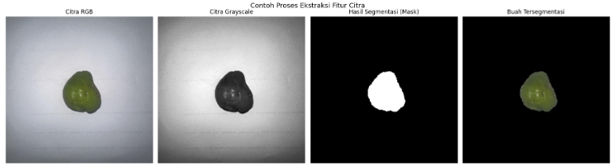
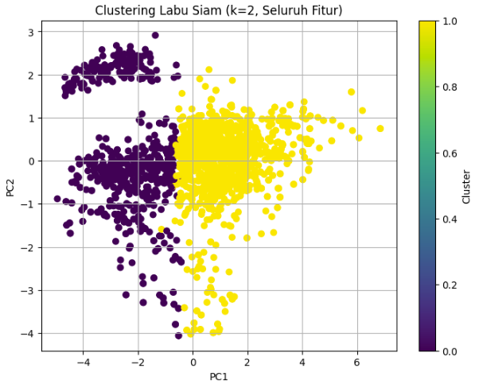
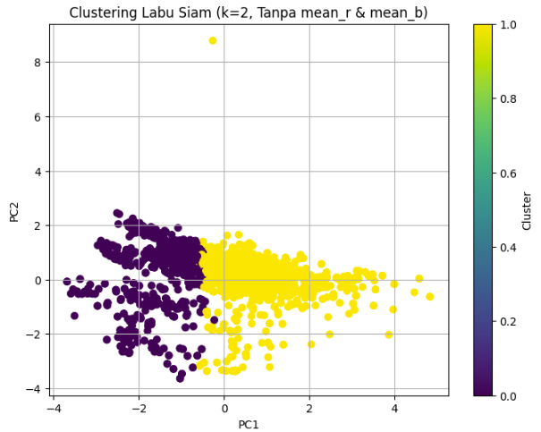

Proyek eksplorasi data dan *Machine Learning (Unsupervised)* yang mengombinasikan teknik *Computer Vision* untuk mengekstraksi fitur visual (warna dan tekstur) dari ribuan citra buah labu siam (*chayote*), lalu mengelompokkannya menggunakan algoritma **K-Means Clustering**. Proyek ini merupakan purwarupa awal untuk menganalisis apakah karakteristik visual dapat membedakan tingkat kesegaran buah.

## Overview (Gambaran Umum)

Dalam industri pertanian dan ritel, kesegaran buah sangat memengaruhi kualitas dan daya jual. Secara visual, buah yang segar dan yang mulai layu seringkali memiliki perbedaan susunan warna dan tekstur permukaan. Proyek ini bertujuan untuk mengekstraksi metrik visual tersebut dari piksel citra dan melihat apakah algoritma *clustering* dapat secara otomatis memisahkan kelompok buah berdasarkan tingkat kesegarannya.

## Rumusan Masalah & Tujuan

**Rumusan Masalah:**
1. Apakah ekstraksi fitur warna (RGB, HSV) dan fitur tekstur (*Local Binary Pattern* / LBP) dari citra labu siam dapat membentuk kelompok visual yang dapat dibedakan oleh mesin?
2. Berapa jumlah klaster (*cluster*) yang paling optimal untuk merepresentasikan pengelompokan data citra ini?

**Tujuan Project:**
- Membangun *pipeline* ekstraksi fitur gambar berbasis Python.
- Melakukan *clustering* menggunakan algoritma K-Means.
- Mengevaluasi hasil *clustering* menggunakan *Silhouette Score* dan *Davies-Bouldin Index*.

## Pendekatan Analisis & Keterbatasan Data

**Catatan:**
Dataset yang digunakan (2.069 citra) belum memiliki label *ground-truth* kesegaran (seperti "Segar" atau "Layu" yang diverifikasi pakar). Oleh karena itu, pendekatan yang digunakan murni *Unsupervised Learning* (Clustering). Klaster yang terbentuk merepresentasikan kemiripan fitur visual piksel, yang menjadi langkah krusial sebelum melangkah ke pemodelan klasifikasi.

## Metodologi Analisis

### 1. Data Preparation & Image Processing
- **Konversi Format:** Mengonversi data mentah dari format HEIC (kamera *smartphone*) menjadi format JPEG yang dapat dibaca oleh OpenCV.
- **Image Segmentation:** Melakukan *resize* citra ke ukuran seragam (256x256), lalu memisahkan objek buah dari latar belakang (*background*) menggunakan metode *HSV Thresholding* dan *Morphological Operations*.

### 2. Feature Extraction
- **Fitur Warna:** Menghitung nilai rata-rata (mean) dari *channel* RGB dan HSV pada area piksel buah yang telah disegmentasi.
- **Fitur Tekstur:** Menggunakan metode *Local Binary Pattern* (LBP) via *scikit-image* untuk menangkap pola tekstur permukaan dan bercak pada kulit buah.

### 3. Clustering & Eksperimen
- **Preprocessing:** Melakukan standarisasi rentang nilai fitur menggunakan `StandardScaler`.
- **Eksperimen Model:** Menguji algoritma **K-Means** dengan membandingkan penggunaan seluruh fitur vs penghapusan fitur warna tertentu (`mean_r` & `mean_b`) untuk melihat sensitivitas fitur.
- **Penentuan K Optimal:** Mengevaluasi metrik klastering dari k=2 hingga k=6.

## Hasil dan Evaluasi Model

Jumlah klaster yang paling optimal dari pengujian metrik adalah **k=2** (dua kelompok utama). Berikut adalah perbandingan metrik evaluasinya:

| Eksperimen Fitur | Silhouette Score (Higher is Better) | Davies-Bouldin Index (Lower is Better) |
|---|---|---|
| **Seluruh Fitur (Warna & Tekstur)** | 0.3886 | 1.1219 |
| **Tanpa fitur mean_r & mean_b** | **0.3921** | 1.2104 |

*Insight:* Membuang beberapa fitur warna (hanya mengandalkan HSV dan tekstur) sedikit meningkatkan kohesi klaster (*Silhouette Score*), menunjukkan bahwa tidak semua channel warna berkontribusi positif pada pemisahan kelompok.

## Visualisasi Utama

*Gambar 1: Pipeline pemrosesan citra, mulai dari citra asli, konversi grayscale, pembuatan mask thresholding, hingga hasil buah tersegmentasi bersih dari background.*

*Gambar 2: Visualisasi sebaran klaster (K=2) menggunakan seluruh fitur warna (RGB, HSV) dan tekstur (LBP). Terlihat bagaimana model membagi data menjadi dua kelompok dengan nilai Silhouette Score 0.3886.*

*Gambar 3: Visualisasi hasil klaster (K=2) setelah fitur `mean_r` dan `mean_b` dieliminasi. Batas pemisahan antar klaster terlihat sedikit lebih kohesif, yang tervalidasi oleh peningkatan nilai Silhouette Score menjadi 0.3921.*

## Kesimpulan & Pengembangan Selanjutnya

1. **Bias Pencahayaan (Keterbatasan Real-World):** Mengingat 2.069 foto dikumpulkan menggunakan 3 kamera *smartphone* yang berbeda, variasi *white balance* dan pencahayaan (*lighting*) terbukti berpotensi memengaruhi nilai warna ekstraksi. Hal ini menjadi catatan evaluasi penting.
2. **Peningkatan Pengumpulan Data:** Ke depannya, pengumpulan data harus dilakukan di dalam *mini-studio box* dengan pencahayaan terkontrol untuk meminimalisasi bias lingkungan.
3. **Transisi ke Supervised Learning:** Analisis ini dapat dikembangkan menjadi sistem deteksi nyata (klasifikasi KNN atau CNN) jika dataset selanjutnya didampingi oleh *ground-truth* kesegaran berupa umur simpan buah atau penilaian pakar pertanian.

---

**Project Status**: ✅ Completed  
**GitHub**: [Lihat Kode Lengkap (Jupyter Notebook)](https://github.com/DanuSetiawan05/Chayote-Freshness-Clustering-Using-KMeans)