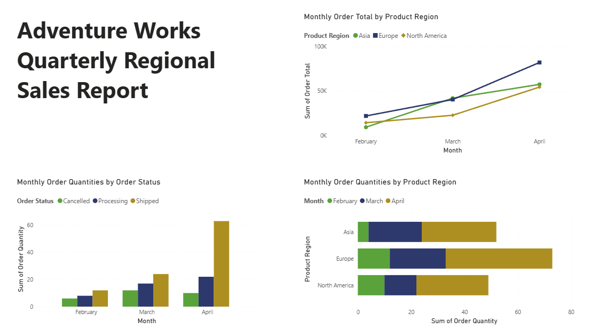
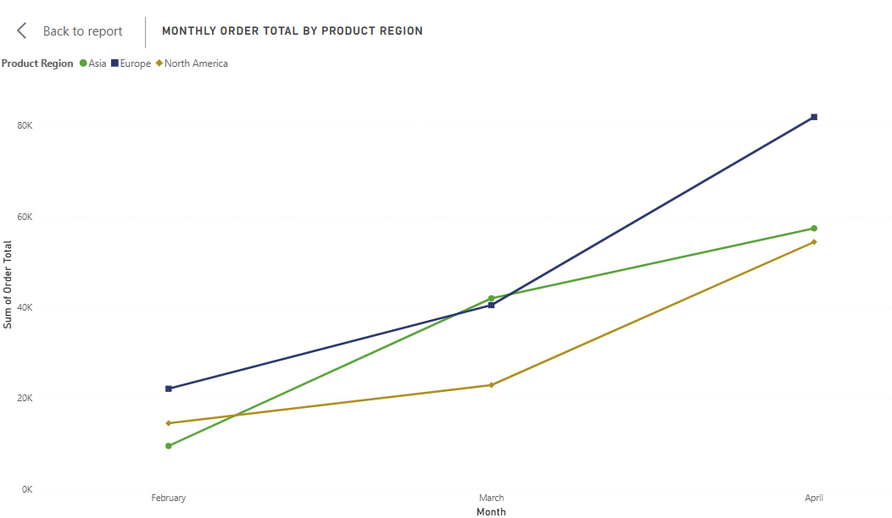
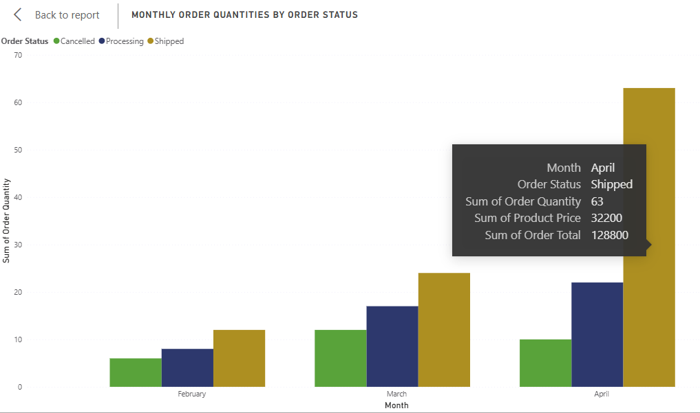

Proyek *Data Visualization* & *Business Intelligence* yang dikerjakan sebagai latihan praktik (*hands-on lab*) dari course **Microsoft Data Analysis and Visualization with Power BI (Coursera)**, modul Creating an Accessible Report. Proyek ini membangun laporan penjualan regional menggunakan dataset Adventure Works, dengan fokus utama pada penerapan prinsip Accessibility, memastikan laporan data dapat digunakan secara setara oleh pengguna dengan berbagai kebutuhan, termasuk pengguna *screen reader*, navigasi keyboard, dan penderita *color blindness*.

## Overview (Gambaran Umum)

Laporan *Business Intelligence* di dunia kerja sering kali hanya dirancang untuk "pengguna rata-rata", sehingga tanpa disadari mengecualikan sebagian pengguna dari akses data. Proyek ini adalah studi kasus kecil untuk mempraktikkan bagaimana sebuah laporan penjualan dapat dibangun agar *accessible by design* sejak awal, menggunakan data transaksi Adventure Works yang mencakup *Order Date, Order Status, Order Total, Order Quantity, Product Price*, dan *Product Region*.

## Latar Belakang & Tujuan

**Latar Belakang:**
Laporan yang hanya mengandalkan warna untuk membedakan kategori, tidak punya deskripsi teks alternatif pada visual, atau tidak mendukung navigasi keyboard, akan sulit digunakan oleh sebagian pengguna, sebuah gap yang penting dipahami setiap Data Analyst, mengingat laporan yang dibuat idealnya bisa dipakai oleh seluruh pemangku kepentingan, bukan hanya sebagian.

**Tujuan Project:**
- Membangun laporan penjualan regional yang informatif sekaligus memenuhi prinsip aksesibilitas dasar Power BI.
- Menerapkan *Alt Text* agar konten visual dapat dibacakan otomatis oleh *screen reader*.
- Mengatur *Tab Order* agar laporan dapat dinavigasi secara logis menggunakan keyboard.
- Memastikan perbedaan kategori data tidak hanya mengandalkan warna, melainkan juga bentuk (*shape*) sebagai penanda tambahan.

## Implementasi

- **Color-Blind Safe Theme:** Menggunakan built-in theme Power BI **"Accessible City Park"** palet warna kontras tinggi yang aman bagi pengguna dengan keterbatasan penglihatan warna.
- **Differensiasi Tanpa Warna:** Pada *Line Chart* (Monthly Order Total by Product Region), tiap region dibedakan lewat warna **dan** bentuk marker (*diamond* vs *circle*), sehingga tetap terbaca dalam mode grayscale.
- **Alt Text:** Pada *Clustered Column Chart* (Monthly Order Quantities by Order Status), ditambahkan deskripsi naratif ringkas tentang tren data untuk mendukung *screen reader*.
- **Tab Order:** Urutan navigasi diatur eksplisit Line Chart → Clustered Column Chart → Bar Chart, agar alur baca konsisten bagi pengguna keyboard/*assistive technology*.

## Insight Data

- Tren pengiriman pesanan (*shipped*) tumbuh eksponensial dari Februari ke April, dengan lonjakan signifikan di bulan April.
- Pesanan dibatalkan (*cancelled*) konsisten menjadi kategori terkecil sepanjang periode tersebut.
- Pesanan dalam proses (*processing*) menunjukkan pertumbuhan stabil dari bulan ke bulan.

## Relevansi Dunia Kerja

Meski berskala latihan, praktik yang diterapkan di sini relevan secara langsung dengan kebutuhan riil di banyak perusahaan: laporan BI yang inklusif membantu memperluas jumlah karyawan yang benar-benar bisa memanfaatkan data untuk pengambilan keputusan, dan menjadi kebiasaan baik (*good practice*) yang selaras dengan kebijakan aksesibilitas digital (mis. WCAG) yang makin banyak diadopsi organisasi.

## Visualisasi Utama

*Gambar 1: Tampilan laporan "Adventure Works Quarterly Regional Sales Report" dengan tema Accessible City Park.*

*Gambar 2: Monthly Order Total by Product Region marker berbeda bentuk per region agar tetap terbaca tanpa bergantung pada warna.*

*Gambar 3: Pengaturan Alt Text pada visual Order Status untuk mendukung pembacaan lewat screen reader.*

## Pengembangan Selanjutnya

- Menguji laporan lebih lanjut dengan *Power BI Accessibility Checker* bawaan untuk memastikan kontras teks & ukuran font memenuhi WCAG 2.1 AA.
- Menerapkan prinsip yang sama pada laporan multi-halaman dengan navigasi antar halaman yang accessible.
- Menambahkan tooltip berbahasa natural untuk mempermudah eksplorasi data oleh pengguna non-teknis.

---

**Project Status**: ✅ Completed  
**GitHub**: [Lihat File Power BI (.pbix)](https://github.com/DanuSetiawan05/Creating-an-Accessible-Report-PowerBI)