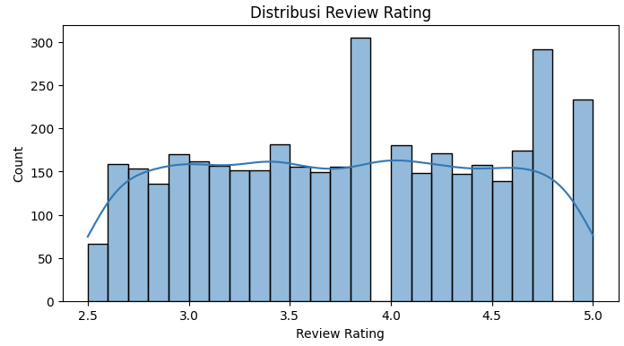
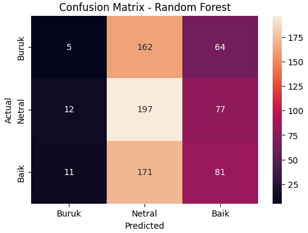

Proyek analisis data dan klasifikasi *Machine Learning* untuk memprediksi tingkat kepuasan pelanggan (Buruk/Netral/Baik) berdasarkan metrik pola belanja seperti kategori barang, jumlah pembelian, lokasi, dan metode pembayaran menggunakan model **Random Forest**. Proyek ini mendemonstrasikan metodologi *data science* yang komprehensif, mulai dari *feature encoding*, pembuatan label, hingga evaluasi.

## Overview (Gambaran Umum)

Perusahaan ritel modern sangat bergantung pada data untuk memahami pola belanja konsumen dan kaitannya dengan kepuasan pelanggan, guna merancang strategi peningkatan pengalaman berbelanja. Model klasifikasi prediktif dapat menjadi alat bantu eksplorasi untuk membedah hubungan ini. Proyek ini berfokus pada eksplorasi metodologi secara utuh pada data transaksi, dengan memberikan pendekatan kritis terhadap evaluasi algoritma dan mengidentifikasi seberapa kuat korelasi antara fitur berbelanja dengan nilai *Review Rating*.

## Rumusan Masalah & Tujuan

**Rumusan Masalah:**
1. Faktor pola belanja apa saja (kategori barang, jumlah pembelian, lokasi, metode pembayaran, dll.) yang berkaitan dengan tingkat kepuasan pelanggan (*Review Rating*)?
2. Seberapa baik model klasifikasi dapat memprediksi tingkat kepuasan pelanggan berdasarkan pola belanja tersebut?

**Tujuan Project:**
- Membangun label tingkat kepuasan (Buruk/Netral/Baik) yang representatif berdasarkan distribusi nilai *Review Rating* yang sebenarnya.
- Membangun *pipeline* model klasifikasi *Random Forest* untuk memprediksi tingkat kepuasan pelanggan.
- Mengevaluasi performa model menggunakan pembanding *baseline* (tebak kelas mayoritas) dan *cross-validation*.

## Metodologi Analisis

### 1. Data Preparation & EDA
- **Pembersihan Data:** Memuat dataset berukuran 3.900 baris, menghapus data duplikat, menangani *missing value* dengan nilai *median* untuk numerik dan *mode* untuk kategorikal, serta menghapus kolom `Customer ID`.
- **Eksplorasi Data:** Memeriksa rentang aktual dari target `Review Rating` yang ternyata berada di skala 2.5 hingga 5.0, sehingga membutuhkan perlakuan khusus untuk pembagian kelas.

### 2. Konstruksi Data & Labeling
- **Data-Driven Labeling:** Daripada menggunakan asumsi manual, label kategori (Buruk/Netral/Baik) dibuat secara dinamis menggunakan nilai *quantile 33%* (skor 3.3) dan *66%* (skor 4.2) dari distribusi data aslinya agar seimbang.
- **Pipeline Transformasi:** Fitur kategorikal (seperti *Gender, Category, Payment Method*) dikonversi menjadi format numerik menggunakan fungsi `OneHotEncoder` di dalam `ColumnTransformer`.

### 3. Modeling & Evaluasi Komparatif
- **Pemodelan:** Menggabungkan tahapan *preprocessing* dan model `RandomForestClassifier` (100 estimators, max depth 12) ke dalam satu *Pipeline* yang rapi.
- **Metode Evaluasi:** Performa diuji pada data uji (*test split*) dan metode *5-fold cross-validation*, lalu dibandingkan dengan metode `DummyClassifier` sebagai *baseline model*.

## Hasil dan Evaluasi Model

| Metode Evaluasi | Akurasi |
|---|---|
| **Baseline (tebak kelas mayoritas)** | 36.7% |
| **Random Forest (cross-validation)** | 35.0% (± 1.2%) |
| **Random Forest (data test)** | 36.3% |

## Keterbatasan & Temuan Penting

1. **Minimnya Sinyal Prediktif:** Hasil evaluasi *cross-validation* yang terukur secara *robust* menunjukkan performa model berada di sekitar atau bahkan sedikit di bawah *baseline* tebakan kelas mayoritas (sekitar 36%). Hal ini mengindikasikan ketiadaan korelasi prediktif yang kuat antara fitur-fitur seperti usia atau jumlah pembelian terhadap *Review Rating*.
2. **Karakteristik Dataset Sintetis:** Temuan ini memperlihatkan fenomena yang umum terjadi pada dataset sintetis, di mana hubungan antar-variabel tidak benar-benar ada atau terjadi secara acak.
3. **Demonstrasi Metodologi:** Walaupun akurasi akhir terbatas oleh sifat bawaan data, proyek ini secara sempurna mendemonstrasikan kelengkapan *workflow Data Science* yang benar (mulai dari pembersihan, adaptasi label distribusi, *pipeline modeling*, hingga verifikasi *baseline*).

## Visualisasi Utama

*Gambar 1: Histogram distribusi Review Rating asli sebelum proses labeling berbasis nilai quantile.*

*Gambar 2: Confusion Matrix pada data uji yang mengonfirmasi tantangan model dalam membedakan pola kelas akibat absennya korelasi fitur yang kuat.*

## Pengembangan Selanjutnya

- Mengaplikasikan metodologi *pipeline* yang telah dibangun ini ke dataset riil (*real-world dataset*) yang memiliki korelasi bisnis yang terbukti jelas antara pola belanja dan tingkat kepuasan.
- Memperluas analisis dengan variabel tambahan yang lebih kuat memberikan sinyal kepuasan, seperti waktu respons *Customer Service*, riwayat komplain, atau waktu pengiriman (*delivery time*).
- Membandingkan kinerja model saat ini dengan pendekatan algoritma lain seperti *Gradient Boosting* atau *Logistic Regression* sebagai bagian dari standar eksperimentasi pemodelan.

---

**Project Status**: ✅ Completed  
**GitHub**: [Lihat Kode Lengkap (Jupyter Notebook)](https://github.com/DanuSetiawan05/Classification-of-Customer-Satisfaction-Ratings-Based-on-Shopping-Patterns)