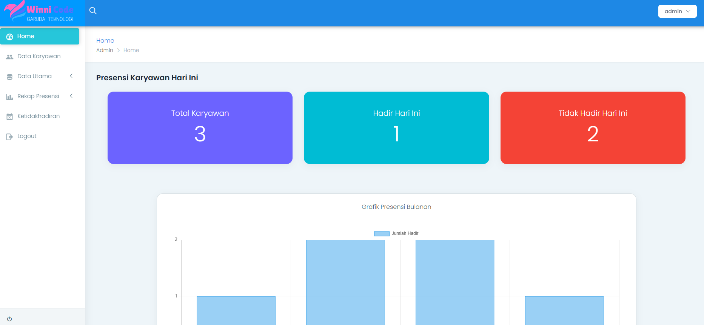
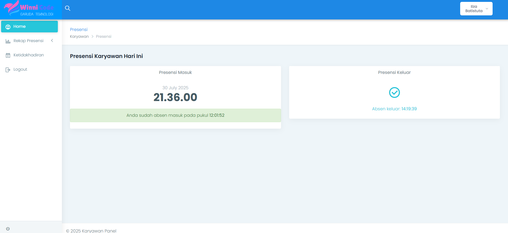
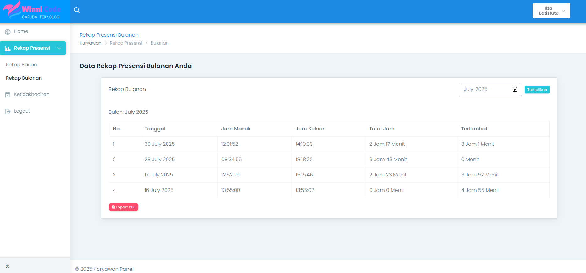
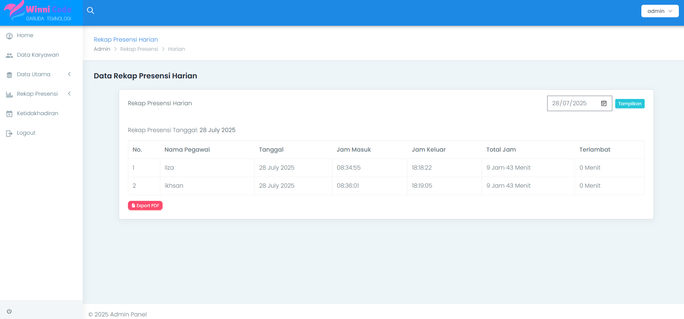
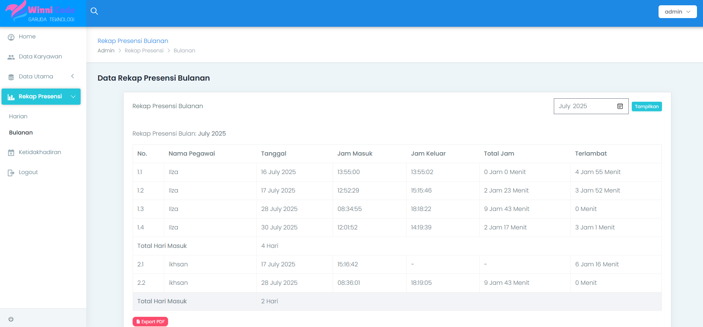
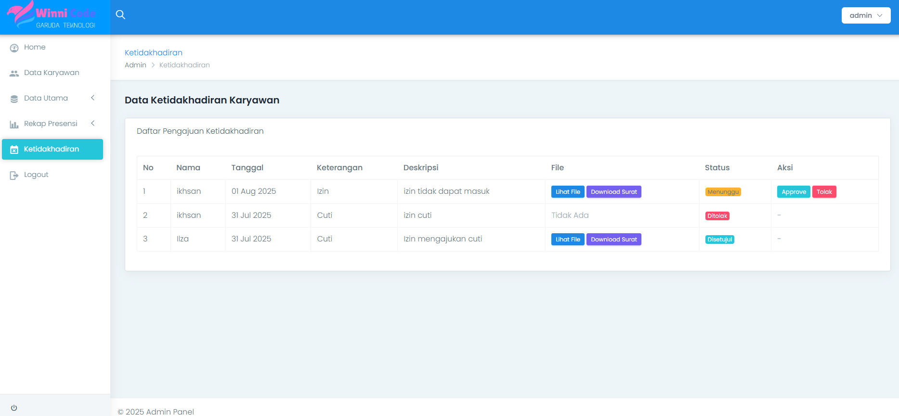

Proyek *Web Development Full-Stack* yang dikerjakan sebagai program magang mandiri (Laravel Developer) untuk membangun sistem absensi karyawan yang efisien dan terstruktur, menggantikan proses pencatatan manual/semi-digital yang rawan kesalahan. Proyek ini mendemonstrasikan kemampuan pengembangan aplikasi web *enterprise* dengan implementasi *Role-Based Access Control* (RBAC), arsitektur *Model-View-Controller* (MVC) menggunakan **Laravel**, serta integrasi pembuatan laporan (PDF Export).

## Overview (Gambaran Umum)

Aplikasi *Employee Attendance System* dirancang untuk mendigitalisasi alur kerja presensi karyawan di perusahaan. Aplikasi ini memisahkan hak akses antara **Karyawan (User)** yang melakukan absensi masuk/keluar dan mengajukan izin secara mandiri, dan **Administrator** yang membutuhkan kontrol penuh terhadap pengelolaan data inti seperti data karyawan, divisi, lokasi presensi, hingga rekap dan verifikasi kehadiran.

## Fitur Utama (Key Features)

### Untuk Admin (Sistem Manajemen)
- **Role-Based Authentication:** Akses login yang aman dan terisolasi khusus untuk admin.
- **Interactive Dashboard:** Halaman utama admin yang menampilkan ringkasan data (total karyawan, hadir/tidak hadir) dan **Visualisasi Data** (grafik statistik kehadiran bulanan) untuk pemantauan cepat.
- **Comprehensive CRUD Module:** Manajemen data *end-to-end* yang mencakup:
  - Kelola data **Karyawan** (foto, nama, divisi, email, telepon).
  - Kelola data **Divisi** & **Lokasi Presensi**.
  - Verifikasi (approve/reject) pengajuan **Ketidakhadiran** (izin/sakit).
- **PDF Reporting:** Fitur *Export to PDF* untuk mencetak rekap presensi harian dan bulanan sebagai bukti administratif.

### Untuk Pengguna (Karyawan)
- **Absensi Mandiri:** Presensi masuk dan keluar langsung dari dashboard, dengan status kehadiran (tepat waktu/terlambat) yang ditentukan otomatis berdasarkan validasi jam kerja.
- **Rekap Presensi:** Melihat dan mengekspor rekap kehadiran harian & bulanan milik sendiri ke format PDF.
- **Leave Request:** Formulir pengajuan izin/sakit (tanggal, keterangan, deskripsi, upload surat) dengan status yang dipantau real-time.
- **User Authentication:** Sistem registrasi dan login yang dikhususkan untuk portal karyawan.

## Arsitektur Teknis (Tech Stack)

Aplikasi ini mengandalkan teknologi backend yang solid dan frontend yang dinamis:
*   **Backend:** PHP dengan framework **Laravel**, arsitektur MVC.
*   **Frontend:** Laravel Blade Templating Engine, dikombinasikan dengan HTML, CSS, dan JavaScript.
*   **Database:** **MySQL**, dirancang dengan ERD (Entity Relationship Diagram) untuk menangani relasi antar entitas (karyawan, presensi, divisi, lokasi).
*   **Security:** Middleware untuk Role-Based Access Control (RBAC) dan validasi form.
*   **Reporting:** Library pembuatan PDF untuk laporan rekap presensi.

## Visualisasi Antarmuka

*Gambar 1: Dashboard Admin yang interaktif, menampilkan ringkasan dan grafik statistik kehadiran karyawan secara real-time.*

*Gambar 2: Tampilan dashboard Karyawan untuk melakukan absensi masuk/keluar dan memantau riwayat kehadiran.*

*Gambar 3: Tampilan rekap presensi bulanan pada portal Karyawan.*

*Gambar 4: Tampilan rekap presensi harian seluruh karyawan pada portal Admin.*

*Gambar 5: Tampilan rekap presensi bulanan seluruh karyawan pada portal Admin.*

*Gambar 6: Tampilan pengelolaan dan verifikasi pengajuan ketidakhadiran (izin/sakit) pada portal Admin.*

---

**Project Status**: ✅ Completed  
**GitHub**: [Lihat Source Code](https://github.com/DanuSetiawan05/Employee-Attendance-System)