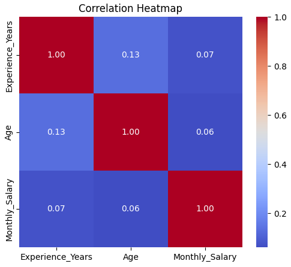
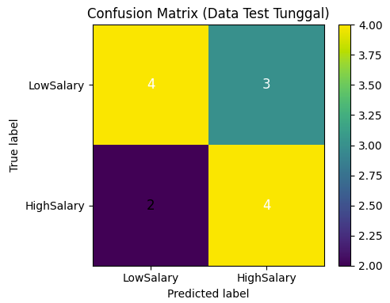
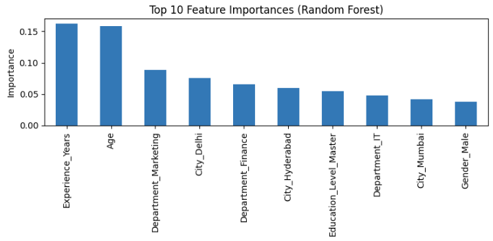

Proyek *Machine Learning* yang mendemonstrasikan metodologi klasifikasi *end-to-end* untuk memprediksi apakah gaji bulanan seorang karyawan tergolong "Tinggi" atau "Rendah" menggunakan **Random Forest**. Proyek ini sangat menitikberatkan pada proses evaluasi yang jujur dan *robust*, dengan mempertimbangkan secara eksplisit keterbatasan ukuran dataset yang digunakan.

## Overview (Gambaran Umum)

Dalam dunia korporat, organisasi sering kali membutuhkan cara cepat untuk memahami atribut karyawan mana yang paling berkaitan dengan kompensasi atau gaji yang lebih tinggi. Model klasifikasi dapat memberikan titik awal berbasis data untuk analisis semacam itu. Namun, tantangan utama dalam analisis dunia nyata adalah ketersediaan data. Proyek ini berfungsi sebagai demonstrasi bagaimana seorang *Data Scientist* harus bersikap transparan dan objektif ketika dihadapkan pada dataset yang sangat minim (hanya 50 baris data).

## Rumusan Masalah & Tujuan

**Rumusan Masalah:**
1. Faktor-faktor apa saja (seperti departemen, lama pengalaman kerja, tingkat pendidikan, usia, gender, dan kota) yang berkaitan erat dengan tingkat gaji karyawan?
2. Seberapa baik model klasifikasi dapat memprediksi kategori gaji, dan seberapa dapat diandalkannya hasil evaluasi tersebut mengingat jumlah data yang sangat terbatas?

**Tujuan Project:**
- Membangun label target klasifikasi biner (Tinggi/Rendah) berdasarkan nilai median gaji bulanan.
- Membangun model prediktif menggunakan algoritma Random Forest.
- Mengevaluasi performa model secara objektif menggunakan metode *Cross-Validation* dan membandingkannya dengan *baseline model*.

## Metodologi Analisis

### 1. Data Preparation & EDA
- **Pembersihan Data:** Memeriksa *missing value* dan duplikat, serta menghapus kolom yang bersifat identitas unik (`EmployeeID` dan `Name`) karena tidak relevan sebagai fitur prediktif.
- **Exploratory Data Analysis (EDA):** Mengevaluasi korelasi fitur numerik (`Experience_Years` dan `Age`) terhadap `Monthly_Salary`. Hasilnya menunjukkan korelasi yang sangat lemah (di bawah 0.1), yang mengindikasikan terbatasnya sinyal prediktif dari fitur yang tersedia.

### 2. Labeling & Preprocessing
- **Pembuatan Label:** Mengubah fitur kontinu `Monthly_Salary` menjadi label target kategorikal (`HighSalary` bernilai 1 atau 0) dengan menggunakan ambang batas median gaji (73.890,50) agar distribusi kelas seimbang.
- **Pipeline Transformasi:** Membangun *Pipeline Scikit-Learn* menggunakan `ColumnTransformer` untuk mengaplikasikan *StandardScaler* pada fitur numerik dan *OneHotEncoder* pada fitur kategorikal.

### 3. Modeling & Robust Evaluation
- Melatih model menggunakan algoritma **Random Forest Classifier** (dengan 100 *estimators*).
- Menggunakan **5-fold Stratified Cross-Validation** untuk mendapatkan estimasi performa yang lebih stabil, mengingat *single train-test split* (yang hanya menyisakan 13 sampel uji) sangat rentan terhadap variasi acak (random seed).

## Hasil dan Evaluasi Model

| Metode Evaluasi | Akurasi |
|---|---|
| **Baseline (Tebak Kelas Mayoritas)** | 50.0% |
| **Random Forest (Cross-Validation)** | 54.0% (± 10.2%) |
| **Random Forest (Single Test Split)** | 61.5% |

*Insight Utama:* Meskipun evaluasi *single test-split* konvensional menghasilkan akurasi yang sekilas tampak baik (61.5%), hasil *cross-validation* yang lebih *robust* membuktikan bahwa performa model (54%) sebenarnya sangat dekat dengan *baseline* (50%). Ini terjadi karena korelasi fitur yang lemah dan kurangnya volume data untuk mempelajari pola yang kompleks.

## Visualisasi Utama

*Gambar 1: Heatmap korelasi yang memperlihatkan rendahnya hubungan linier antara variabel usia maupun pengalaman kerja terhadap gaji bulanan karyawan.*

*Gambar 2: Confusion Matrix dari hasil single test-split yang menunjukkan distribusi tebakan benar dan salah dari model pada 13 data uji.*

*Gambar 3: Visualisasi Feature Importance yang diekstrak dari algoritma Random Forest untuk melihat bobot kontribusi setiap fitur (termasuk fitur yang telah di-encode).*

## Kesimpulan & Rekomendasi

1. **Pentingnya Transparansi Evaluasi:** Proyek ini membuktikan bahayanya hanya mengandalkan *single train-test split* pada data kecil. Model di sini berfungsi sebagai demonstrasi arsitektur *pipeline Machine Learning* yang lengkap, bukan sebagai sistem produksi akhir.
2. **Keterbatasan Sinyal Prediktif:** Fitur demografis dasar yang digunakan tidak cukup kuat untuk menebak gaji. Analisis ke depannya harus melibatkan pengumpulan dataset yang lebih masif serta penambahan fitur yang lebih berbobot, seperti matriks performa kerja (*performance rating*) atau tingkatan level jabatan.

---

**Project Status**: ✅ Completed  
**GitHub**: [Lihat Kode Lengkap (Jupyter Notebook)](https://github.com/DanuSetiawan05/Employee-Salary-Level-Classification)