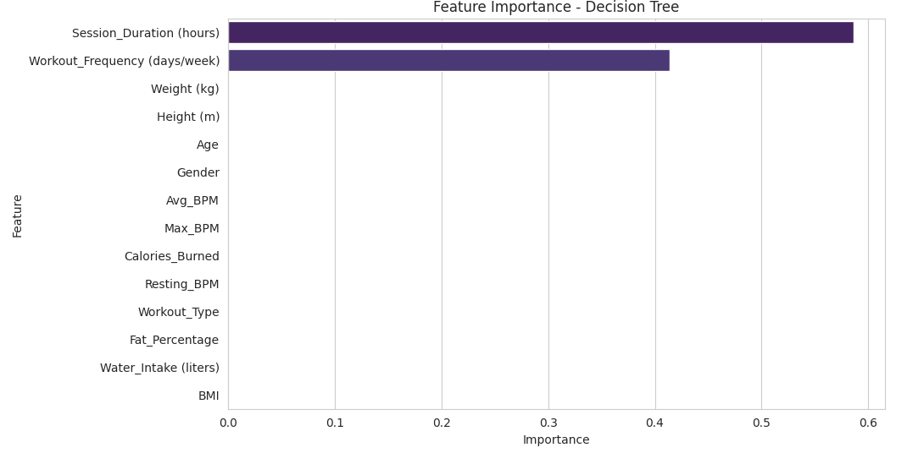
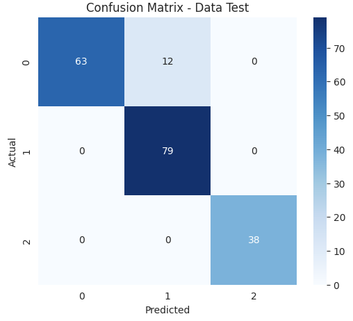
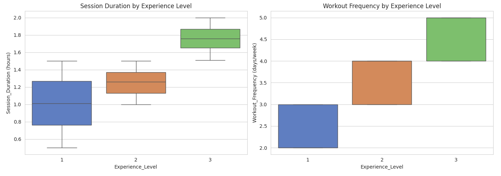

Proyek klasifikasi tingkat pengalaman (**Experience Level**) anggota gym berdasarkan data aktivitas dan fisik menggunakan algoritma **Decision Tree Classifier**. 

## Overview (Gambaran Umum)

Gym dan pusat kebugaran modern semakin banyak memanfaatkan data untuk memahami perilaku dan kebutuhan anggotanya. Salah satu informasi yang berguna adalah tingkat pengalaman (Experience Level) anggota. Apakah mereka pemula, menengah, atau mahir, karena informasi ini dapat digunakan untuk personalisasi program latihan, rekomendasi kelas, hingga strategi retensi member. Namun, tidak semua member secara eksplisit mencantumkan tingkat pengalamannya, sehingga dibutuhkan model klasifikasi yang dapat memprediksinya berdasarkan data yang lebih mudah didapat.

## Rumusan Masalah & Tujuan

**Rumusan Masalah:**
1. Faktor apa saja baik atribut fisik (usia, berat badan, tinggi badan, BPM, dll.) maupun kebiasaan latihan (durasi, frekuensi) yang paling berpengaruh dalam menentukan Experience Level seorang gym member?
2. Seberapa akurat model Decision Tree dapat mengklasifikasikan Experience Level berdasarkan faktor-faktor tersebut?

**Tujuan Project:**
- Membangun model klasifikasi Experience Level menggunakan Decision Tree.
- Mengidentifikasi fitur yang paling berkontribusi terhadap prediksi (feature importance).
- Mengevaluasi performa model secara valid menggunakan data uji yang benar-benar terpisah dari data latih, dibandingkan dengan baseline model.

## Metodologi Analisis

### 1. Data Preparation & EDA
- ### 1. Data Understanding & Preparation
- **Eksplorasi Data:** Pengecekan struktur data, missing value, duplikat, dan distribusi target. Target/label yang diprediksi adalah `Experience_Level` dengan tiga kategori: 1 = Pemula, 2 = Menengah, 3 = Mahir.
- **Pembersihan Data:** Penanganan missing value dan duplikat, penghapusan outlier menggunakan Z-score, serta encoding fitur kategorikal.
- Correlation heatmap dan visualisasi hubungan antar fitur terhadap target, dilakukan sebelum tahap modeling untuk memahami pola data secara menyeluruh.

### 2. Modeling & Evaluasi (Decision Tree)
- **Data Splitting:** Data dibagi menjadi data latih (80%) dan data uji (20%).
- **Tuning Hyperparameter:** Pemilihan `max_depth` optimal dilakukan melalui 5-fold cross-validation untuk mencegah overfitting.
- **Evaluasi:** Performa diuji pada data uji yang terpisah dari data latih, dilengkapi confusion matrix, classification report, dan cross-validation.

### 3. Feature Importance & Interpretasi
- Analisis fitur yang paling berpengaruh terhadap hasil prediksi model, untuk memahami faktor apa yang benar-benar mendorong tingkat pengalaman member.

## Hasil dan Evaluasi Model

### Kinerja Model (Decision Tree)
- **Baseline Accuracy** (prediksi kelas mayoritas): 41.2%
- **max_depth optimal** (hasil cross-validation): 4
- **Akurasi Data Train:** 89.3%
- **Akurasi Data Test:** 93.8%
- **Cross-Validation Accuracy (5-fold):** 89.1% ± 3.4%

## Manfaat & Dampak

**Untuk Bisnis/Gym:**
Membantu pengelola gym melakukan segmentasi member otomatis tanpa perlu member mengisi survei tingkat pengalaman secara manual, sekaligus mendukung personalisasi program latihan member pemula dan mahir bisa diarahkan ke jenis program/kelas yang lebih sesuai.

**Untuk Individu/Trainer:**
Personal trainer dapat memahami lebih cepat profil member baru berdasarkan pola aktivitas awal mereka, tanpa menunggu asesmen manual yang panjang.

**Dari Sisi Teknis (Data Science):**
Studi kasus penerapan klasifikasi dengan Decision Tree pada data perilaku dan atribut fisik, termasuk bagaimana melakukan validasi model yang genuine menggunakan cross-validation serta menginterpretasikan feature importance untuk pengambilan keputusan bisnis.

## Visualisasi Utama

*Gambar 1: Feature importance menunjukkan Session_Duration dan Workout_Frequency sebagai dua fitur paling berpengaruh terhadap prediksi Experience Level.*

*Gambar 2: Confusion matrix pada data uji yang menunjukkan performa model dalam membedakan ketiga kelas Experience Level (Pemula, Menengah, Mahir).*

*Gambar 3: Distribusi Session Duration dan Workout Frequency terhadap Experience Level, menunjukkan pola yang jelas antar kategori sebelum tahap modeling.*

## Kesimpulan & Rekomendasi

1. **Kebiasaan Latihan sebagai Penentu Utama:** Feature importance menunjukkan bahwa Session_Duration (durasi latihan) dan Workout_Frequency (frekuensi latihan) adalah dua faktor yang paling dominan dalam menentukan Experience Level, sementara atribut fisik/demografis seperti usia, berat badan, tinggi badan, dan BPM memiliki kontribusi yang sangat kecil. Sehingga program intervensi sebaiknya difokuskan pada konsistensi latihan member, bukan semata karakteristik demografis.
2. **Keandalan Model:** Dengan akurasi data uji sebesar 93.8% dan cross-validation yang konsisten (89.1% ± 3.4%), model ini cukup andal untuk digunakan sebagai alat bantu segmentasi awal member gym.
3. **Pengembangan Lanjutan:** Membandingkan performa dengan algoritma lain (Random Forest, KNN) untuk validasi konsistensi feature importance, serta menambahkan penanganan class imbalance karena kelas "mahir" memiliki jumlah data lebih sedikit.

---

**Project Status**: ✅ Completed  
**GitHub**: [Lihat Kode Lengkap (Jupyter Notebook)](https://github.com/DanuSetiawan05/Classification-Gym-Member-Exercise-Tracking)
