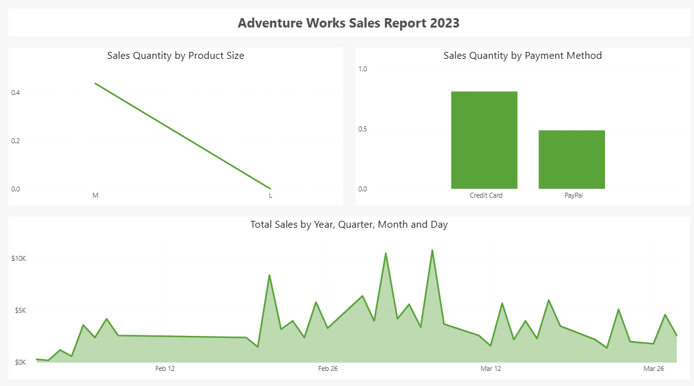
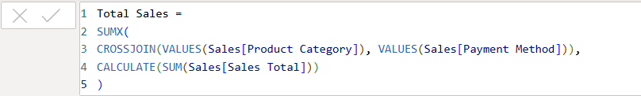

Proyek *Data Modeling* yang dikerjakan sebagai latihan praktik (*hands-on lab*) dari course **Microsoft Data Analysis and Visualization with Power BI (Coursera)**, pada modul "Improving DAX Performance". Berbeda dari project-project sebelumnya yang berfokus pada pemilihan visual, project ini menitikberatkan pada sisi teknis di balik layar, bagaimana sebuah DAX measure ditulis dapat memengaruhi performa laporan, bukan hanya hasil akhirnya.

## Overview (Gambaran Umum)

Laporan ini dibangun di atas dataset **Adventure Works Sales** yang telah dirapikan lewat Power Query, dengan penamaan kolom yang distandarkan (`Order ID` menjadi `Sales ID`, `Order Date` menjadi `Sales Date`, `Order Total` menjadi `Sales Total`, dan seterusnya). Fokus utamanya bukan pada insight bisnis, melainkan pada satu DAX measure bernama `Total Sales` yang secara sengaja ditulis dengan pola yang tidak efisien, sebagai bahan latihan mengenali dan memperbaiki masalah performa DAX.

## Latar Belakang & Tujuan

**Latar Belakang:**
DAX measure yang menghasilkan angka benar belum tentu efisien secara komputasi. Sebuah measure bisa saja menghasilkan hasil identik dengan cara yang jauh lebih berat, misalnya dengan membangun kombinasi silang (*cross join*) dari dua kolom dimensi lalu menghitung ulang agregasi untuk tiap kombinasi tersebut, padahal cukup dijumlahkan langsung dari tabel fakta. Mengenali pola seperti ini penting dikuasai siapa pun yang bertanggung jawab menjaga performa laporan Power BI, terutama saat data bertambah besar.

**Tujuan Project:**
- Mengenali pola penulisan DAX yang berpotensi menyebabkan masalah performa.
- Memahami alternatif penulisan DAX yang lebih ringan untuk logika agregasi yang sama.
- Melatih penggunaan Power Query untuk pembersihan data (filter baris kosong, rename kolom) sebagai fondasi model data yang rapi sebelum menulis DAX.

## Implementasi

- **Power Query: Pembersihan & Standardisasi Data**
Data dimuat dari CSV (`Sales - Updated.csv`), lalu melalui beberapa tahap transformasi: *Promote Headers*, perbaikan locale angka desimal (`Product Price`, `Product Weight`, `Order Total`), **filter baris** yang memiliki `Product Description` atau `Product Subcategory` kosong, dan **rename kolom** agar konsisten dengan terminologi "Sales" (`Order ID` menjadi `Sales ID`, `Order Date` menjadi `Sales Date`, `Order Status` menjadi `Sales Status`, `Order Quantity` menjadi `Sales Quantity`, `Order Total` menjadi `Sales Total`).

- **DAX: Measure yang Tidak Efisien**
Measure `Total Sales` ditulis sebagai berikut:

```dax
Total Sales =
SUMX(
    CROSSJOIN(VALUES(Sales[Product Category]), VALUES(Sales[Payment Method])),
    CALCULATE(SUM(Sales[Sales Total]))
)
```

Pola ini membentuk seluruh kombinasi `Product Category` dan `Payment Method` lebih dulu lewat `CROSSJOIN`, lalu menjalankan `CALCULATE(SUM(...))` berulang untuk tiap kombinasi tersebut. Hasil akhirnya identik dengan cukup menulis `SUM(Sales[Sales Total])` secara langsung, namun cara di atas jauh lebih mahal karena memicu *context transition* berulang kali, satu untuk setiap kombinasi kategori yang dihasilkan `CROSSJOIN`.

- **Visual pada Laporan**
Halaman laporan menampilkan tiga visual: *Line Chart* (standar deviasi `Sales Quantity` per `Product Size`), *Column Chart* (standar deviasi `Sales Quantity` per `Payment Method`), dan *Area Chart* (tren nilai penjualan terhadap hierarki tanggal Year/Quarter/Month/Day).

## Insight Data

- Measure `Total Sales` adalah contoh nyata pola DAX yang benar secara hasil, tapi tidak efisien secara eksekusi, karena membebankan kerja tambahan berupa pembentukan kombinasi kategori yang sebenarnya tidak diperlukan untuk mendapatkan total penjualan.
- Pada *Area Chart*, ditemukan referensi ke field bernama `Inefficient Total Sales1` yang tidak tercatat sebagai measure aktif di data model saat ini kemungkinan ini adalah jejak dari measure versi sebelum diberi nama ulang menjadi `Total Sales` selama proses latihan optimasi berlangsung.
- Dua visual lain sengaja menggunakan agregasi *Standard Deviation* (bukan Sum/Average), menunjukkan variasi jumlah pesanan antar ukuran produk dan metode pembayaran, bukan sekadar totalnya.

## Relevansi Dunia Kerja

Kemampuan mengenali dan memperbaiki DAX yang tidak efisien menjadi krusial ketika ukuran dataset di perusahaan bertambah besar: measure yang lambat dapat membuat laporan terasa berat, memperlambat proses refresh, hingga membebani kapasitas komputasi Power BI Service secara tidak perlu. Kebiasaan menulis DAX yang ringkas dan efisien sejak awal membantu tim data menjaga laporan tetap responsif seiring pertumbuhan data perusahaan.

## Visualisasi Utama


*Gambar 1: Tampilan laporan "Adventure Works Sales Report 2023" yang dipakai sebagai media latihan optimasi DAX.*


*Gambar 2: Formula measure Total Sales pada panel DAX Editor Power BI Desktop.*

## Pengembangan Selanjutnya

- Menulis ulang measure `Total Sales` menjadi versi yang lebih efisien, misalnya cukup `SUM(Sales[Sales Total])`, lalu membandingkan waktu eksekusi keduanya menggunakan Performance Analyzer bawaan Power BI.
- Menelusuri lebih lanjut jejak measure `Inefficient Total Sales1` yang masih tertinggal pada referensi visual, untuk memastikan seluruh visual memakai measure versi final yang sudah dioptimasi.
- Mempelajari penggunaan variabel (`VAR`) dalam DAX untuk menghindari perhitungan berulang pada measure yang lebih kompleks.

**Project Status**: Completed
**GitHub**: [Lihat File Power BI (.pbix)](https://github.com/DanuSetiawan05/Improving-DAX-Performance-PowerBI)
