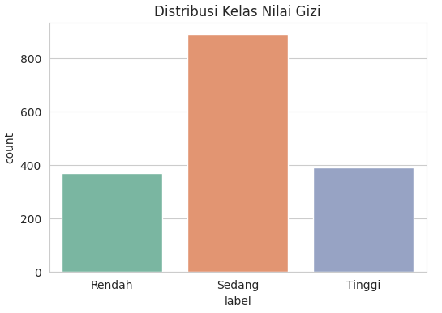
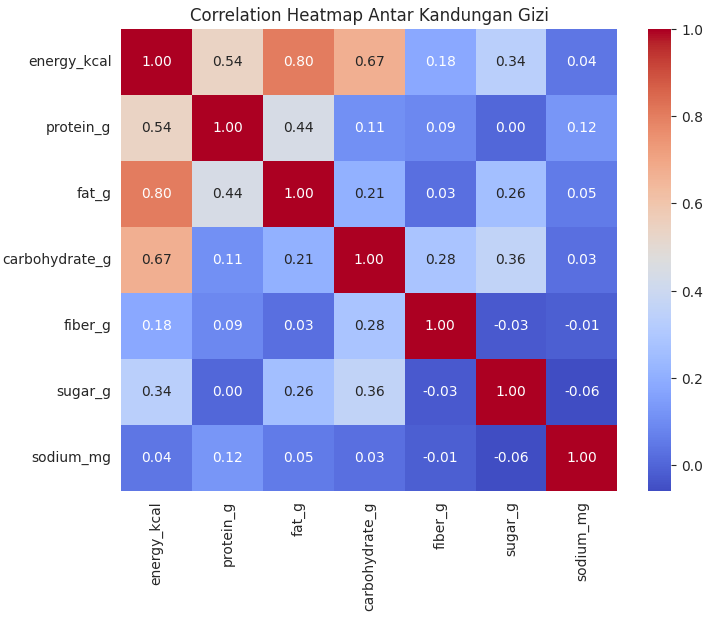
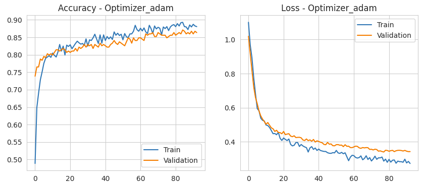

Proyek *Deep Learning* komprehensif untuk mengklasifikasikan produk makanan dan minuman ke dalam tingkat nilai gizi (Rendah/Sedang/Tinggi) menggunakan **Artificial Neural Network (ANN)**. Proyek ini berfokus pada eksperimen perbandingan konfigurasi *optimizer*, *activation function*, dan *learning rate* untuk merancang arsitektur model klasifikasi yang paling optimal.

## Overview (Gambaran Umum)

Konsumen saat ini semakin membutuhkan cara yang cepat dan praktis untuk menilai kualitas gizi suatu produk makanan atau minuman tanpa harus menghitung manual dari label kemasan. Sistem klasifikasi otomatis menggunakan model *Deep Learning* ini dibangun untuk mengelompokkan produk secara konsisten. Hal ini berpotensi menjadi dasar sistem pelabelan otomatis yang krusial bagi produsen maupun regulator pangan untuk mengelola *database* berskala besar.

## Rumusan Masalah & Tujuan

**Rumusan Masalah:**
1. Bagaimana cara mengelompokkan produk makanan dan minuman ke dalam kategori nilai gizi dengan memanfaatkan pola dari kandungan nutrisinya?
2. Konfigurasi arsitektur Artificial Neural Network seperti apa (*optimizer*, *activation function*, *learning rate*) yang memberikan performa klasifikasi paling presisi untuk kasus ini?

**Tujuan Project:**
- Menyusun label kategori gizi (Rendah/Sedang/Tinggi) berdasarkan aturan skor komposisi nutrisi.
- Membangun dan melatih model klasifikasi ANN yang dievaluasi dengan berbagai eksperimen *hyperparameter*.
- Menentukan konfigurasi terbaik dari hasil eksperimen serta mengevaluasi performa model akhirnya secara menyeluruh.

## Metodologi Analisis

### 1. Data Preparation & Feature Selection
- **Eksplorasi & Pembersihan:** Mengeksplorasi dataset berisi 1.651 baris data dengan 7 fitur gizi utama (energi, protein, lemak, karbohidrat, serat, gula, sodium), serta memverifikasi bahwa tidak ada *missing value* maupun data duplikat.
- **Pembuatan Label:** Kategori nilai gizi dirumuskan berdasarkan aturan batas skor nutrisi, seperti dukungan untuk protein dan serat yang tinggi, serta batasan ketat untuk gula, lemak, dan natrium.

### 2. Preprocessing & Class Weighting
- **Data Splitting & Scaling:** Memisahkan data menjadi 1.320 sampel data latih dan 331 sampel data uji secara *stratified*, yang dilanjutkan dengan standarisasi menggunakan *StandardScaler*.
- **Penanganan Imbalance:** Distribusi target menunjukkan ketidakseimbangan (kategori "Sedang" mendominasi), sehingga algoritma `compute_class_weight` diterapkan agar pembobotan model tetap adil dan tidak bias terhadap kelas mayoritas.

### 3. Modeling & Eksperimen ANN
- **Arsitektur Model:** Membangun *Sequential model* di Keras menggunakan lapisan *Dense*, fungsi *Dropout* (0.3) untuk mencegah *overfitting*, serta *L2 Regularization*. Proses pelatihan didukung oleh *callbacks* `EarlyStopping` dan `ReduceLROnPlateau`.
- **Eksperimen Hyperparameter:** Model dievaluasi secara iteratif dengan menguji kombinasi *optimizer* (Adam vs SGD), fungsi aktivasi (ReLU vs Leaky ReLU), dan besaran *learning rate* (0.01 vs 0.001).

## Hasil dan Evaluasi Model

### Kinerja Model Akhir (ANN)
- **Akurasi Pengujian (Test):** 79.46%
- **F1-Score:** 0.80 (Rendah) / 0.79 (Sedang) / 0.80 (Tinggi)
- **Hasil Eksperimen Konfigurasi:** Berdasarkan analisis, pemanfaatan **Adam Optimizer** mencatatkan akurasi pelatihan/validasi terbaik mencapai ~87.9% dengan tingkat *loss* terendah (0.34), jauh mengungguli algoritma optimasi *SGD* (73.7%).

## Manfaat & Dampak

**Untuk Konsumen:** 
Membantu percepatan penilaian kualitas gizi produk pangan secara praktis di kehidupan sehari-hari tanpa keharusan menghitung secara manual.

**Untuk Produsen / Regulator Pangan:** 
Sistem klasifikasi cerdas ini dapat difungsikan sebagai landasan untuk otomatisasi pelabelan produk gizi dalam skala industri.

**Dari Sisi Teknis (Data Science):** 
Studi kasus ini memberikan validasi teknis mengenai pengaruh eksperimen *hyperparameter* di dalam jaringan *Artificial Neural Network* dalam menangani klasifikasi multi-kelas.

## Visualisasi Utama

*Gambar 1: Distribusi kelas nilai gizi yang memperlihatkan kondisi imbalance, di mana kategori "Sedang" mendominasi sebaran data target.*

*Gambar 2: Heatmap korelasi antar tujuh fitur nutrisi utama yang membuktikan bahwa tiap fitur membawa informasi gizi yang unik.*

*Gambar 3: Tabel ringkasan eksperimen ANN yang menunjukkan keunggulan Adam Optimizer sebagai algoritma yang paling optimal dalam mereduksi tingkat loss.*

## Kesimpulan & Rekomendasi Selanjutnya

1. **Efektivitas Hyperparameter:** Eksperimen secara meyakinkan menunjukkan bahwa optimasi parameter (seperti penggunaan Adam Optimizer) sangat krusial dalam mendongkrak performa ANN secara signifikan dibandingkan pengaturan bawaan standar.
2. **Keseimbangan Metrik:** Pemakaian *class weight* terbukti sukses menjaga distribusi presisi metrik *F1-Score* berada di rasio seimbang (rata-rata 0.80) antar ketiga kategori gizi, meskipun data aslinya bersifat *imbalanced*.
3. **Pengembangan Kedepan:** Model ini dapat diperkaya dengan memasukkan fitur non-nutrisi (seperti harga produk atau kategori kemasan) dan direkomendasikan untuk diperbandingkan (*benchmark*) dengan algoritma klasik seperti Random Forest.

---

**Project Status**: ✅ Completed  
**GitHub**: [Lihat Kode Lengkap (Jupyter Notebook)](https://github.com/DanuSetiawan05/Classification-of-Nutritional-Value-Levels-of-Food-and-Beverages)