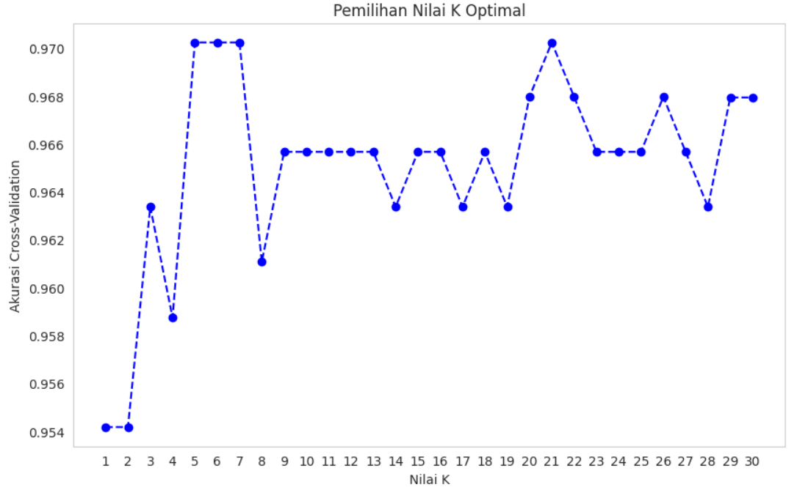
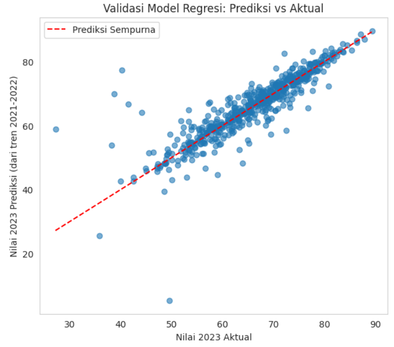
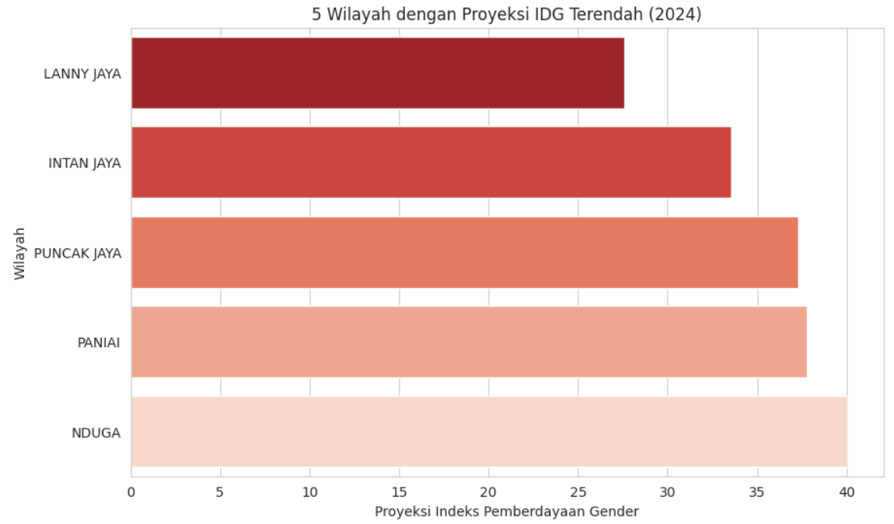

Proyek analisis data dan Machine Learning komprehensif untuk mengklasifikasi dan memproyeksikan **Indeks Pemberdayaan Gender (IDG)** di tingkat kabupaten/kota di Indonesia. Proyek ini menggunakan dua pendekatan sekaligus: Klasifikasi untuk mengelompokkan wilayah ke kategori "Tinggi" atau "Rendah", dan Regresi untuk memproyeksikan nilai IDG pada tahun 2024.

## Overview (Gambaran Umum)

Indeks Pemberdayaan Gender mengukur sejauh mana perempuan berperan aktif dalam kehidupan ekonomi dan politik. Tujuan dari analisis ini adalah untuk memetakan wilayah mana saja yang tertinggal (kategori Rendah) dan memprediksi tren di masa depan agar pemerintah atau Kementerian PPPA dapat menentukan prioritas program pemberdayaan perempuan secara lebih terarah dan berbasis data.

## Metodologi Analisis

### 1. Data Preparation & EDA
- **Pembersihan Data:** Menghapus baris agregat nasional ("INDONESIA"), menangani nilai duplikat pada nama lokasi yang sama, dan menghapus nilai kosong.
- **Korelasi Historis:** Berdasarkan heatmap korelasi, nilai IDG antar tahun (2021, 2022, 2023) menunjukkan korelasi yang sangat tinggi, mengindikasikan bahwa nilai IDG cenderung stabil dan bersifat struktural.

### 2. Pendekatan Klasifikasi (K-Nearest Neighbors)
- **Penanganan Data Leakage:** Label "Tinggi" (>70) dan "Rendah" (<=70) dibuat berdasarkan data tahun 2023, sehingga data 2023 tidak dijadikan fitur. Model murni belajar dari tren 2021 dan 2022 untuk menghindari kebocoran data.
- **Tuning Hyperparameter:** Pemilihan nilai K optimal dilakukan melalui *cross-validation*.

### 3. Pendekatan Regresi (Linear Regression)
- **Validasi Proyeksi:** Model regresi divalidasi dengan melatih data tahun 2021-2022 untuk memprediksi tahun 2023, lalu membandingkannya dengan data asli 2023 untuk mendapatkan tingkat kesalahan yang jujur.
- **Proyeksi Masa Depan:** Menggunakan seluruh data historis untuk memproyeksikan nilai IDG tiap wilayah pada tahun 2024.

## Hasil dan Evaluasi Model

### Kinerja Model Klasifikasi (KNN)
- **Parameter Terbaik:** K=5
- **Akurasi (Accuracy):** 94.5% pada data uji (test data)
- **F1-Score:** 0.96 untuk kategori "Rendah" dan 0.93 untuk kategori "Tinggi"

### Kinerja Model Regresi (Validasi 2023)
- **R-Squared (R²):** 0.755 (Model dapat menjelaskan 75.5% variansi data proyeksi)
- **RMSE:** 4.75 poin indeks
- **MAE:** 2.59 poin indeks

## Visualisasi Utama

*Gambar 1: Pemilihan nilai K optimal melalui Cross-Validation yang stabil di angka K=5.*

*Gambar 2: Validasi model regresi yang membandingkan nilai prediksi (berdasarkan tren 2021-2022) dengan nilai aktual 2023.*

*Gambar 3: Proyeksi 5 wilayah dengan Indeks Pemberdayaan Gender terendah pada tahun 2024 (seperti Lanny Jaya dan Intan Jaya) sebagai rekomendasi prioritas kebijakan.*

## Kesimpulan & Rekomendasi Kebijakan

1. **Konsistensi Struktural:** Wilayah dengan IDG terendah (seperti Lanny Jaya, Intan Jaya, dan Puncak Jaya) relatif konsisten dari tahun ke tahun. Ini menunjukkan bahwa kesenjangan gender di sana bersifat struktural dan membutuhkan intervensi jangka panjang.
2. **Keandalan Proyeksi:** Dengan RMSE sebesar 4.75 poin, hasil proyeksi model regresi untuk tahun 2024 dapat dipertanggungjawabkan dan dapat menjadi sistem peringatan dini (*early warning*) bagi wilayah yang trennya menurun.

---

**Project Status**: ✅ Completed  
**GitHub**: [Lihat Kode Lengkap (Jupyter Notebook)](https://github.com/DanuSetiawan05/Classification-and-Regression-Gender-Empowerment-Index)