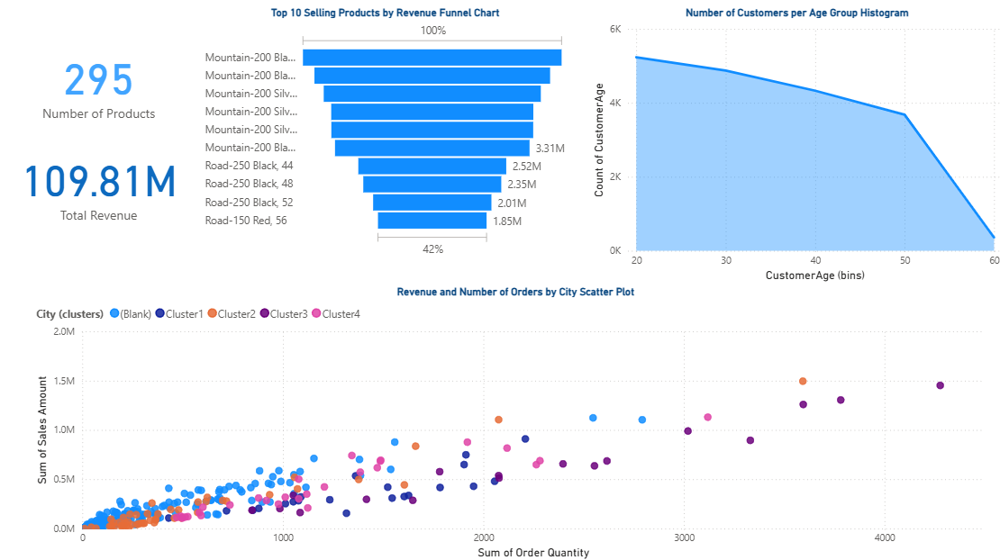
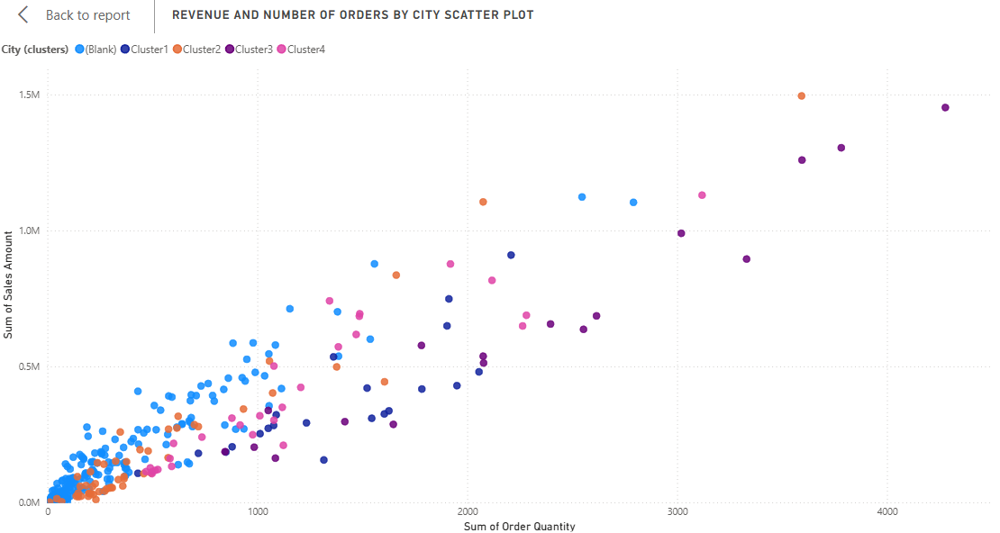
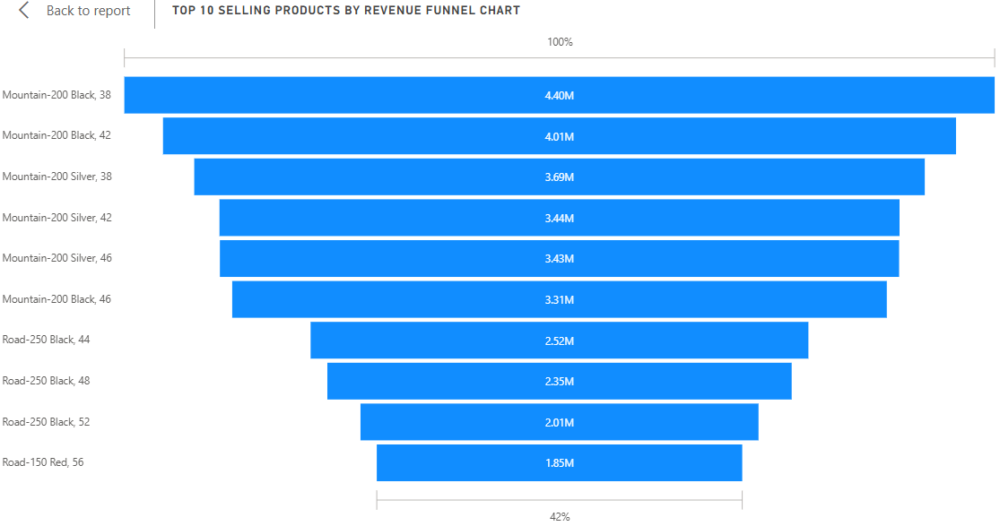

Proyek *Data Analysis* yang dikerjakan sebagai latihan praktik (*hands-on lab*) dari course **Microsoft Data Analysis and Visualization with Power BI (Coursera)**, pada modul "Performing an Analysis". Berbeda dari lima project sebelumnya yang memakai satu tabel data penjualan datar (*flat table*), project ini bekerja dengan model data relasional yang lebih representatif terhadap struktur data di dunia nyata.

## Overview (Gambaran Umum)

Laporan ini dibangun di atas workbook **AdventureWorks Sales.xlsx**, yang berisi enam tabel terpisah: `Sales` (tabel fakta transaksi), serta `Product`, `Customer`, `Reseller`, `SalesTerritory`, `Date`, dan `SalesOrder` sebagai tabel dimensi pendukung. Kelima tabel dimensi ini saling terhubung ke tabel `Sales` lewat relationship resmi di Power BI, membentuk struktur **star schema** yang jauh lebih dekat dengan praktik pemodelan data di lingkungan kerja sesungguhnya dibanding satu tabel datar.

## Latar Belakang & Tujuan

**Latar Belakang:**
Analisis data di dunia kerja jarang sekali hanya melibatkan satu tabel. Data biasanya tersebar di beberapa tabel terpisah (transaksi, produk, pelanggan, wilayah, dan sebagainya) yang perlu dihubungkan lebih dulu sebelum bisa dianalisis secara utuh. Kemampuan memodelkan relasi antar tabel dan memilih teknik analisis yang tepat (distribusi, pengelompokan, tren) menjadi keterampilan inti seorang Data Analyst.

**Tujuan Project:**
- Bekerja dengan model data relasional multi-tabel (star schema).
- Melakukan binning otomatis pada data numerik (usia pelanggan) untuk analisis distribusi.
- Memanfaatkan fitur *automatic clustering* Power BI untuk menemukan pengelompokan alami pada data reseller berdasarkan lokasi.

## Implementasi

**Data Modeling: Star Schema**
Tabel `Sales` sebagai fact table terhubung ke lima tabel dimensi lewat relationship eksplisit: `Product` (M:1 lewat `ProductKey`), `Reseller` (M:1 lewat `ResellerKey`), `SalesTerritory` (M:1 lewat `SalesTerritoryKey`), `Date` (M:1 lewat `OrderDateKey`), dan `SalesOrder` (1:1 lewat `SalesOrderLineKey`).

**Power Query**
Setiap tabel dimuat dari sheet terpisah pada workbook Excel yang sama, dengan transformasi *Change Type* untuk menyesuaikan tipe data tiap kolom. Pada tabel `Customer` dan `Reseller`, ditambahkan langkah **Removed Top Rows** untuk membuang baris duplikat header di awal data.

**Binning & Clustering**
- **Customer Age Binning:** Kolom `CustomerAge` dikelompokkan otomatis ke dalam rentang (`CustomerAge (bins)`) menggunakan fitur *New Group* bawaan Power BI.
- **Automatic Clustering:** Kolom `City (clusters)` pada tabel `Reseller` dihasilkan dari fitur *Automatically find clusters* Power BI pada Scatter Chart, yang membuat tabel bantu tersembunyi `ClusterMappingTable` untuk memetakan tiap kota ke kelompok klasternya.

**Visual pada Laporan**
- **Funnel Chart:** `Sum(Sales Amount)` per `Product`.
- **2 Card:** menampilkan `Min(Product)` dan `Sum(Sales Amount)` sebagai ringkasan angka kunci.
- **Area Chart:** `Sum(CustomerAge)` terhadap `CustomerAge (bins)`.
- **Scatter Chart:** `Sum(Order Quantity)` (X) vs `Sum(Sales Amount)` (Y) per `Reseller.City`, diwarnai berdasarkan hasil `City (clusters)`.

## Insight Data

- Model data pada project ini benar-benar berbentuk star schema dengan 5 relationship eksplisit, jauh lebih representatif dibanding tabel datar tunggal yang dipakai pada project-project sebelumnya.
- Area Chart menghitung `Sum` dari `CustomerAge` per kelompok usia, bukan `Count` jumlah pelanggan per kelompok usia sebuah pilihan agregasi yang cukup jarang dipakai untuk analisis distribusi usia, karena representasi distribusi biasanya lebih umum ditampilkan lewat jumlah pelanggan per kelompok, bukan jumlah total usia.

## Relevansi Dunia Kerja

Kemampuan membangun dan bekerja dengan star schema relevan langsung dengan cara data disimpan di kebanyakan data warehouse perusahaan. Fitur clustering membantu tim sales/operasional mengelompokkan reseller atau wilayah secara objektif berdasarkan pola data, bukan asumsi manual, sementara binning usia pelanggan mendukung tim marketing dalam menyusun segmentasi kampanye yang lebih tepat sasaran.

## Visualisasi Utama

*Gambar 1: Tampilan penuh laporan analisis pada Page 1.*

*Gambar 2: Scatter Chart Order Quantity vs Sales Amount, diwarnai berdasarkan hasil automatic clustering kota reseller.*

*Gambar 3: Funnel Chart total Sales Amount per produk.*

## Pengembangan Selanjutnya

- Menempatkan visual Play Axis pada kanvas laporan agar animasi data benar-benar aktif dan dapat digunakan.
- Mengubah agregasi pada Area Chart dari Sum menjadi Count of Customer agar representasi distribusi usia lebih standar dan mudah dibaca.
- Menambahkan DAX measure eksplisit (misalnya Total Sales Amount, Average Order Value) untuk KPI yang lebih reusable dibanding mengandalkan implicit measure.

**Project Status**: Completed
**GitHub**: [Lihat File Power BI (.pbix)](https://github.com/DanuSetiawan05/Performing-an-Analysis-PowerBI)
