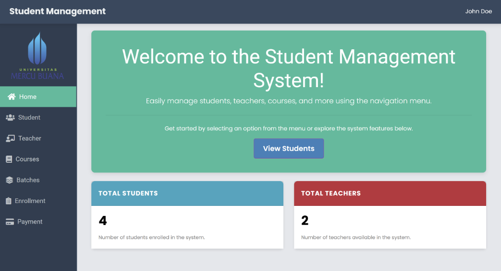
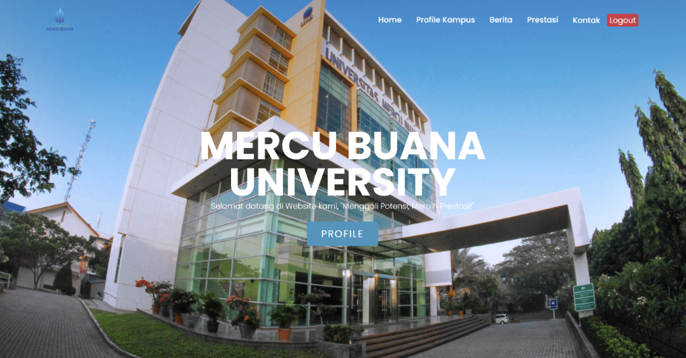

Proyek *Web Development Full-Stack* untuk membangun sistem administrasi akademik yang efisien dan terstruktur. Proyek ini mendemonstrasikan kemampuan pengembangan aplikasi web berskala *enterprise* dengan implementasi *Role-Based Access Control* (RBAC), arsitektur *Model-View-Controller* (MVC) menggunakan **Laravel 11**, serta integrasi pembuatan laporan (PDF Export).

## Overview (Gambaran Umum)

Aplikasi *Student Management System* dirancang untuk mendigitalisasi dan mempermudah alur kerja administrasi kampus. Aplikasi ini memisahkan hak akses antara **Pengguna Umum (User/Siswa)** yang membutuhkan informasi kampus interaktif, dan **Administrator** yang membutuhkan kontrol penuh terhadap pengelolaan data inti akademik seperti data siswa, pengajar, kursus, angkatan, hingga pendaftaran dan pembayaran.

## Fitur Utama (Key Features)

### Untuk Admin (Sistem Manajemen)
- **Role-Based Authentication:** Akses login yang aman dan terisolasi khusus untuk staf admin.
- **Interactive Dashboard:** Halaman utama admin yang menampilkan ringkasan data dan **Visualisasi Data** (grafik distribusi siswa dan guru) untuk pemantauan cepat.
- **Comprehensive CRUD Module:** Manajemen data *end-to-end* yang mencakup:
  - Kelola data **Siswa** & **Pengajar** (mendukung unggah foto profil).
  - Kelola data **Course** (Mata Pelajaran) & **Batch** (Angkatan).
  - Kelola data **Enrollment** (Pendaftaran Siswa).
  - Kelola riwayat **Payment** (Pembayaran).
- **PDF Reporting:** Fitur *Export to PDF* untuk mencetak tanda terima (*receipt*) pembayaran sebagai bukti administratif.

### Untuk Pengguna (User/Siswa)
- **Portal Informatif:** Halaman beranda yang menyajikan Profil Kampus, Berita akademik, dan daftar Prestasi Mahasiswa.
- **Contact & Inquiry:** Formulir pesan (*contact form*) interaktif yang terhubung langsung ke email administrator.
- **User Authentication:** Sistem registrasi dan login yang dikhususkan untuk pengalaman portal siswa.

## Arsitektur Teknis (Tech Stack)

Aplikasi ini mengandalkan teknologi backend yang solid dan frontend yang dinamis:
*   **Backend:** PHP 8+ dengan framework modern **Laravel 11**.
*   **Frontend:** Laravel Blade Templating Engine, dikombinasikan dengan HTML, CSS, dan JavaScript.
*   **Database:** **MySQL** untuk menangani skema relasi data yang kompleks antar modul akademik.
*   **Reporting:** Library pembuatan PDF untuk laporan transaksi dan administrasi.

## Visualisasi Antarmuka

*Gambar 1: Dashboard Admin yang interaktif, menampilkan grafik perbandingan data siswa dan pengajar secara real-time.*

*Gambar 2: Tampilan antarmuka pengguna (User) yang informatif dan responsif untuk melihat profil dan berita kampus.*

---

**Project Status**: ✅ Completed  
**GitHub**: [Lihat Source Code](https://github.com/DanuSetiawan05/Student-Management)