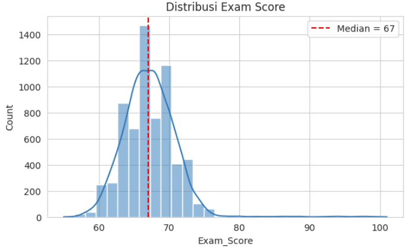
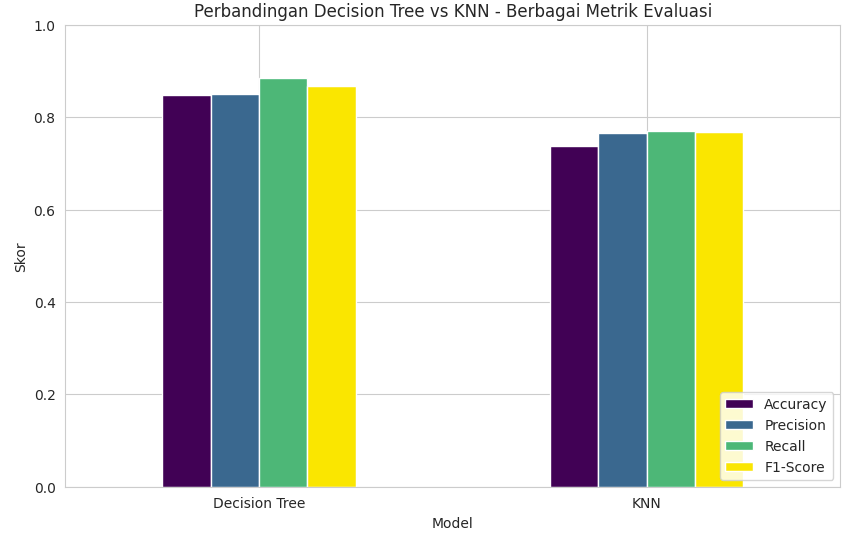
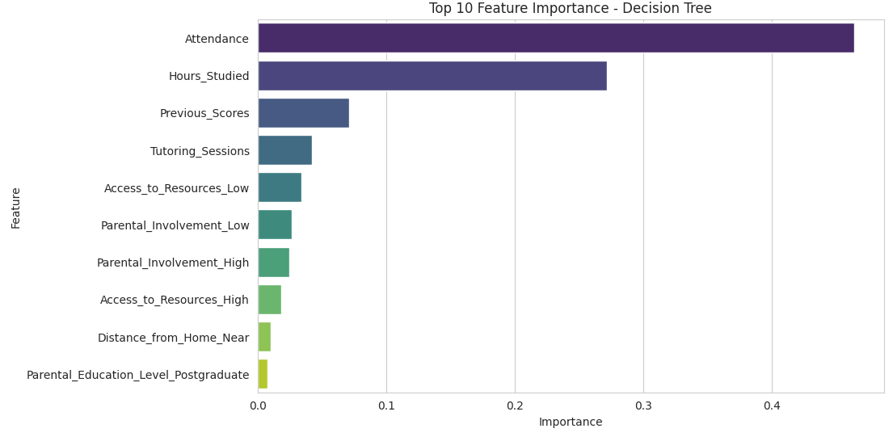

Proyek analisis data dan Machine Learning untuk mengklasifikasi status kelulusan siswa (Lulus/Tidak Lulus) berdasarkan faktor-faktor performa akademik. Proyek ini membandingkan performa dua algoritma klasifikasi, yaitu **Decision Tree** dan **K-Nearest Neighbors (KNN)**, untuk menemukan model terbaik dalam memprediksi hasil evaluasi belajar siswa.

## Overview (Gambaran Umum)

Performa akademik siswa dipengaruhi oleh banyak faktor mulai dari kebiasaan belajar, kehadiran di kelas, keterlibatan orang tua, hingga kondisi lingkungan sekitar. Tujuan dari analisis ini adalah mengidentifikasi faktor mana yang paling berpengaruh dan membangun model prediktif sehingga pihak sekolah dapat melakukan intervensi (seperti bimbingan tambahan atau konseling) lebih awal terhadap siswa yang berisiko tidak lulus.

## Rumusan Masalah & Tujuan

**Rumusan Masalah:**
1. Faktor apa saja yang paling berpengaruh terhadap nilai ujian siswa?
2. Seberapa baik algoritma Decision Tree dan KNN dapat memprediksi status kelulusan siswa berdasarkan faktor-faktor tersebut?
3. Di antara kedua algoritma, mana yang memberikan performa lebih baik untuk kasus ini?

**Tujuan Project:**
- Mengidentifikasi faktor-faktor yang paling berkorelasi dengan nilai ujian siswa melalui eksplorasi data.
- Membangun model klasifikasi Lulus/Tidak Lulus menggunakan Decision Tree dan KNN dengan fitur yang dipilih berdasarkan hasil eksplorasi.
- Membandingkan performa kedua model secara adil (masing-masing di-tuning melalui cross-validation).

## Metodologi Analisis

### 1. Data Preparation & EDA
- **Pemilihan Fitur:** Melakukan eksplorasi korelasi fitur numerik dan rata-rata skor per kategori terhadap *Exam_Score* untuk memilih fitur yang paling relevan secara objektif.
- **Penanganan Data:** Menghapus baris data dengan nilai kosong (missing value) pada fitur terpilih agar tidak mengganggu proses pemodelan.
- **Kategorisasi Target:** Mengubah variabel kontinu `Exam_Score` menjadi label biner `Pass_Status` (Lulus/Tidak Lulus) dengan menetapkan ambang batas nilai 67, yang merupakan nilai median dari distribusi skor.

### 2. Preprocessing & Data Splitting
- **Pembagian Data:** Membagi dataset menjadi data latih (80%) dan data uji (20%) menggunakan *stratified split* agar proporsi kelas "Lulus" dan "Tidak Lulus" tetap seimbang.
- **Normalisasi:** Melakukan normalisasi *MinMax* pada fitur numerik untuk mencegah fitur berskala besar mendominasi perhitungan jarak, sehingga mengoptimalkan kinerja algoritma KNN.

### 3. Pendekatan Klasifikasi (Decision Tree vs KNN)
- **Tuning Hyperparameter:** Pemilihan kedalaman pohon optimal (`max_depth`) untuk Decision Tree dan nilai ketetanggaan (`K`) untuk KNN dievaluasi secara adil menggunakan metode *10-fold cross-validation*.

## Hasil dan Evaluasi Model

### Kinerja Model Decision Tree
- **Parameter Terbaik:** max_depth=8
- **Akurasi (Accuracy):** 84.7%
- **F1-Score:** 86.8%
- **Precision & Recall:** Precision 85.1% dan Recall 88.5%

### Kinerja Model KNN
- **Parameter Terbaik:** K=14
- **Akurasi (Accuracy):** 73.6%
- **F1-Score:** 76.7%
- **Precision & Recall:** Precision 76.5% dan Recall 77%

## Manfaat & Dampak

**Untuk Institusi Pendidikan/Sekolah:**
Membantu pihak sekolah mengidentifikasi siswa berisiko tidak lulus sejak dini, sehingga intervensi seperti bimbingan tambahan atau konseling bisa dilakukan lebih cepat dan tepat sasaran.

**Untuk Orang Tua & Siswa:**
Memberi wawasan konkret bahwa kehadiran (Attendance) dan jam belajar (Hours_Studied) berpengaruh jauh lebih besar terhadap nilai dibanding faktor demografis seperti gender, mendukung fokus pada kebiasaan yang benar-benar bisa diperbaiki.

**Dari Sisi Teknis (Data Science):**
Menjadi studi kasus perbandingan dua algoritma klasifikasi populer (tree-based vs distance-based) yang di-tuning secara adil, sebagai referensi pemilihan algoritma untuk kasus klasifikasi biner serupa.

## Visualisasi Utama

*Gambar 1: Distribusi Exam Score dengan garis batas median pada nilai 67 yang dijadikan acuan klasifikasi Lulus/Tidak Lulus.*

*Gambar 2: Perbandingan Decision Tree vs KNN pada berbagai metrik evaluasi (Accuracy, Precision, Recall, F1-Score), menunjukkan Decision Tree secara konsisten unggul di seluruh metrik.*

*Gambar 3: Top 10 feature importance dari model Decision Tree, dengan Attendance dan Hours_Studied sebagai dua fitur paling berpengaruh terhadap prediksi kelulusan siswa.*

## Kesimpulan & Rekomendasi Kebijakan

1. **Keunggulan Model Berbasis Aturan:** Model Decision Tree secara konsisten mengungguli KNN di seluruh metrik evaluasi untuk kasus klasifikasi ini. Hal ini menunjukkan bahwa dataset performa akademik ini memiliki batas keputusan (*decision boundary*) yang lebih cocok direpresentasikan dalam bentuk aturan bertingkat (*tree-based*) dibandingkan pendekatan jarak geometris (*distance-based*).
2. **Faktor Dominan Penentu Kelulusan:** Faktor kehadiran (`Attendance`) dan jam belajar (`Hours_Studied`) adalah faktor numerik dengan korelasi terkuat terhadap kelulusan, sedangkan faktor demografis seperti `Gender` hampir tidak memiliki pengaruh sama sekali. Rekomendasi praktis bagi sekolah dan orang tua adalah memfokuskan program intervensi pada perbaikan kehadiran dan kedisiplinan jam belajar.

---

**Project Status**: ✅ Completed  
**GitHub**: [Lihat Kode Lengkap (Jupyter Notebook)](https://github.com/DanuSetiawan05/Student-Performance-Classification-DT-vs-KNN)